# HTB - Bitlab

Checking the Gitlab server, there are different projects:

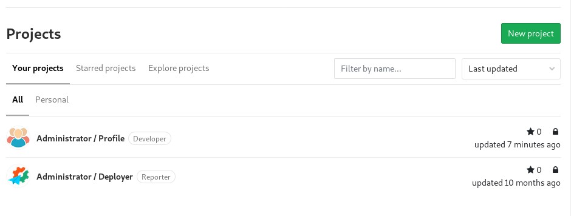

There are different commits in them:

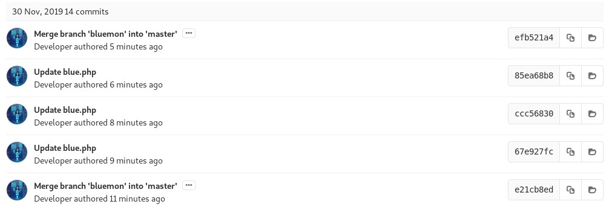

It is possible to update the PHP code of the index.php of your Profile. So, when you access that page, this code (a PHP reverse shell) will get executed:

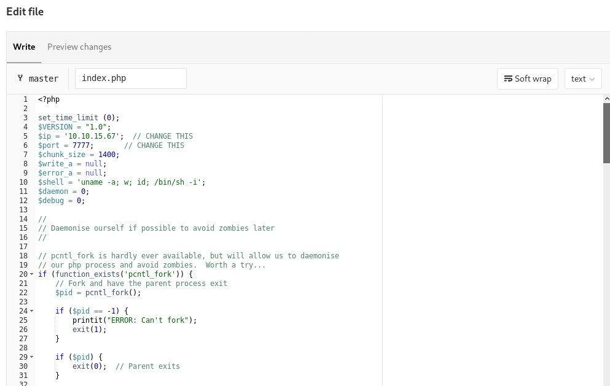

It is necessary to merger the branch:

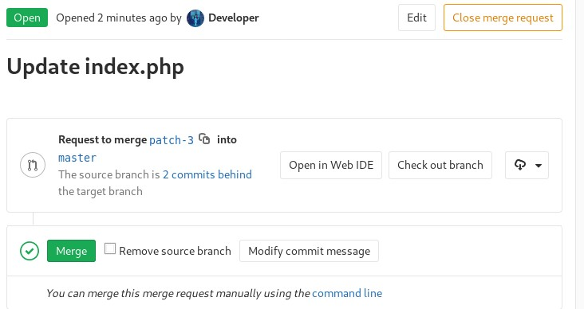

When it gets finally merged...

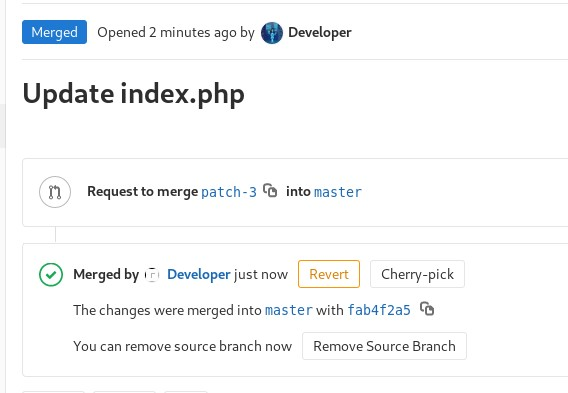

... you can see the file has been updated recently:

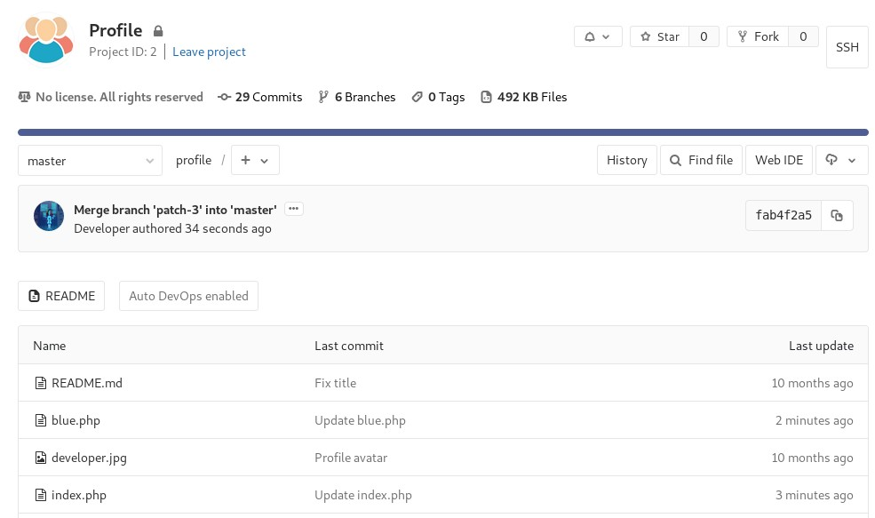

Accessing the PHP file...

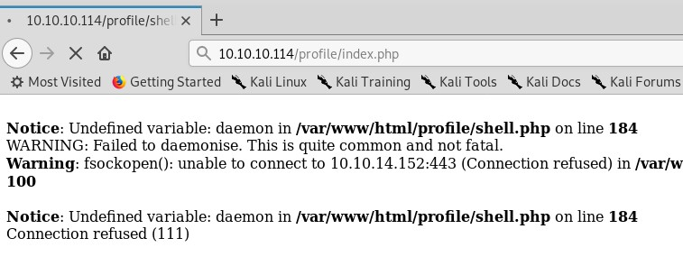

... you get a reverse shell:

Also in the Gitlab repository, you can see there are some credentials:

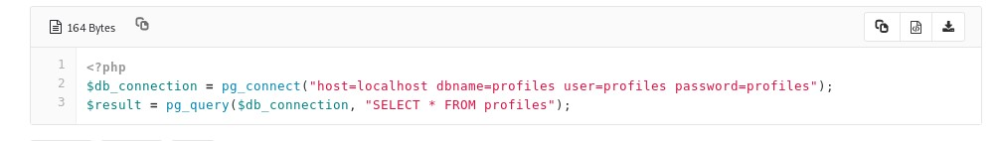

Copying this code to the server, we can get some new credentials:

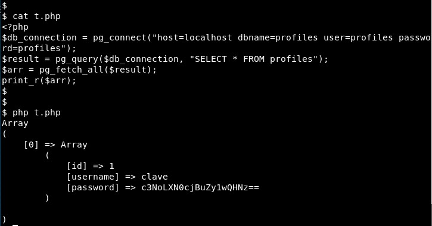

It is a base64-encoded value!

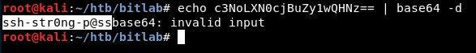

We can get more information from the database:

But also, we can connect via SSH with the credentials we already got. The trick was that the password was the base64 value, it was not necessary to decode it:

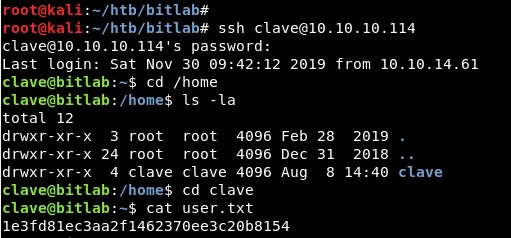

There is a Windows executable file in the home folder, so we will copy this to our local machine:

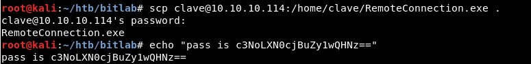

Then it is time to reverse it. First, we will check the interesting module, the one named similarly to the executable file. 

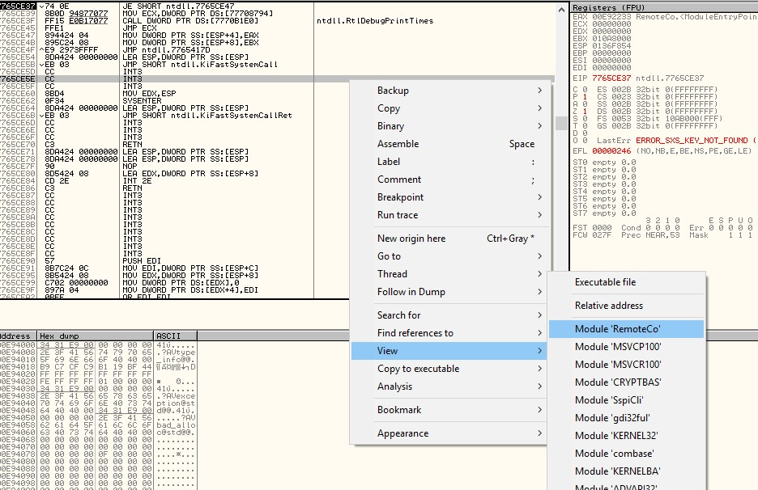

Then, it is enough to look for the references of the strings:

There are some strings we can see when the executable file is run:

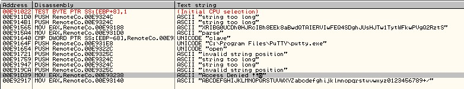

Let us check the code section where the string "Access Denied!!" is used:

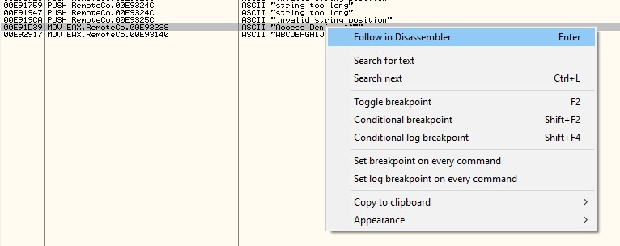

There is a SSH password, so...

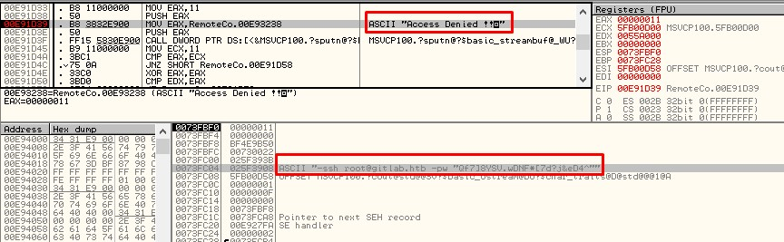

... we connect using it, and it is done

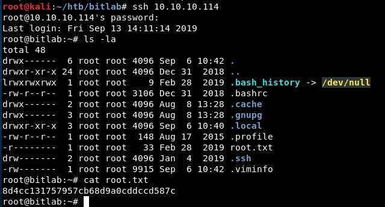

