# HTB - Craft

First, it is necessary to run a nmap scan:

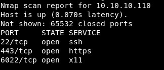


Then, fuzz the directories of the website in port 443:

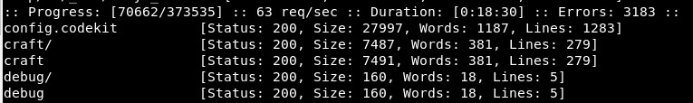


As there is a Git repository, it is downloaded:

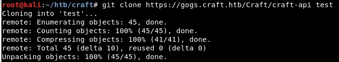


Then it is possible to check the previous commits with *git log*. To get a shorter version of the commits IDs, you can use *--oneline*:

```
git log --oneline
```

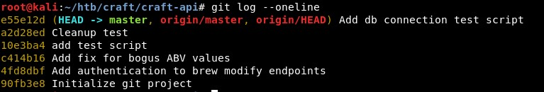


It is possible to use a bash script, but in this case there are not many commits so we will check the difference in the code of every two commits with:

```
git diff commit1 commit2
```

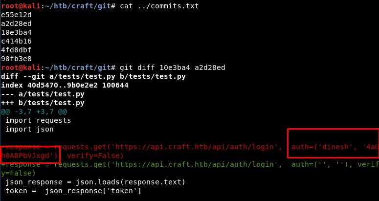


It is possible to log in with those credentials:

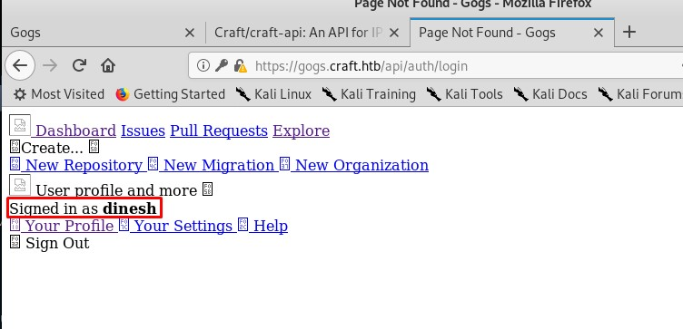


Let us continue checking the commits. The script *test.py* could be interesting:

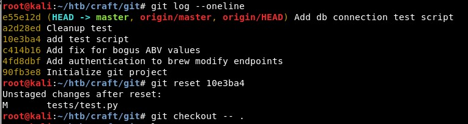


It is possible to execute it:

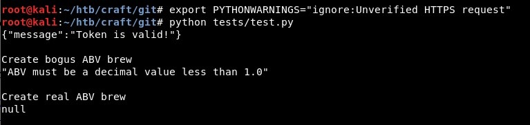


And we can add one line to print the generated token...

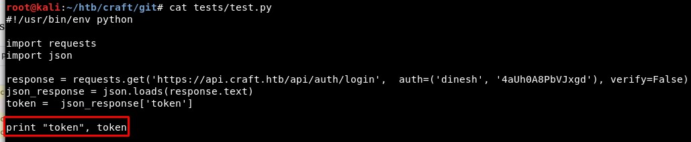


... which can be decoded in jwt.io

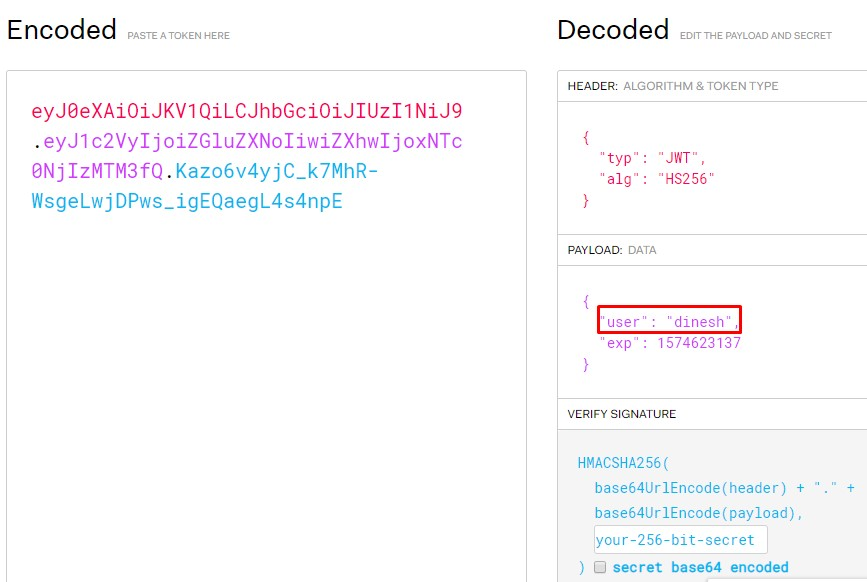


Ok, we can use this token to create requests... For example POST requests to /api/brew, whose paramter *abv* is vulnerable!

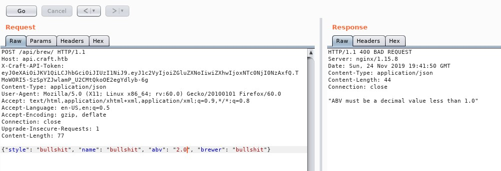


We can try to create a reverse shell using this vulnerable parameter, so let us update the *test.py* code:

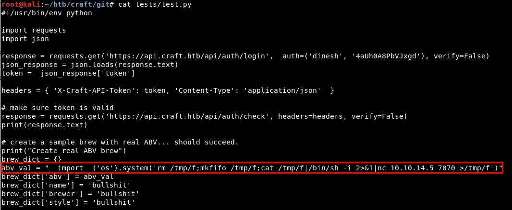


Hmm, it seems good...

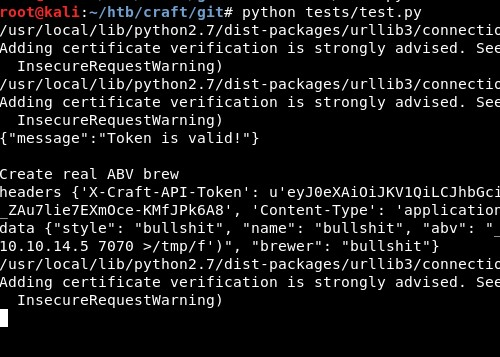


... nice, we got a reverse shell!

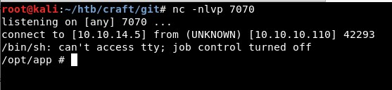


Now we can read the settings values, including the DB credentials:

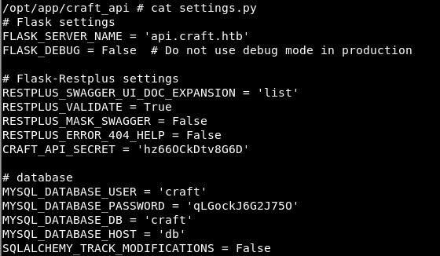


User "Gilfoyle" can download another repository:

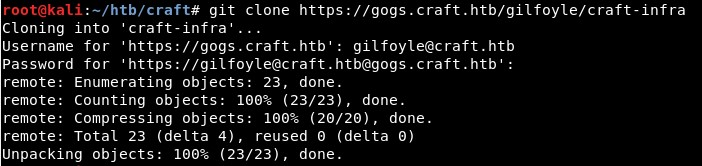


Inside that repository, there was a SSH key which allows us to access as user "gilfoyle"

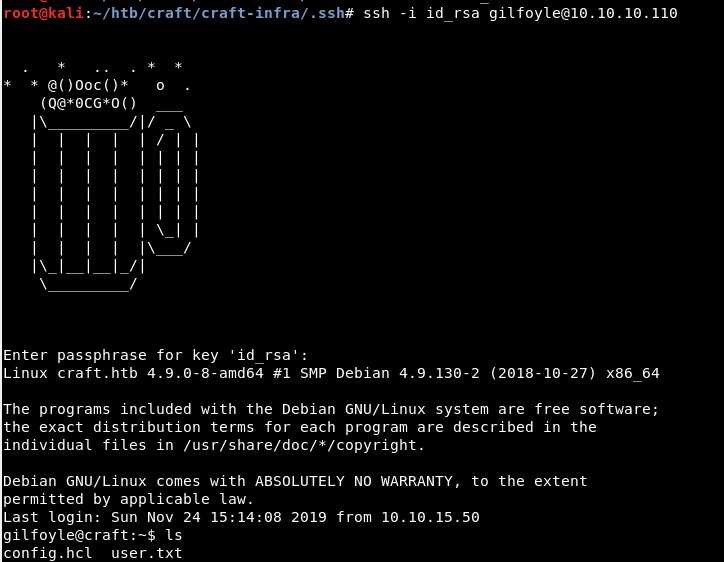


Finally, a vulnerability in Vault service allows us to escalate privileges and become "root":

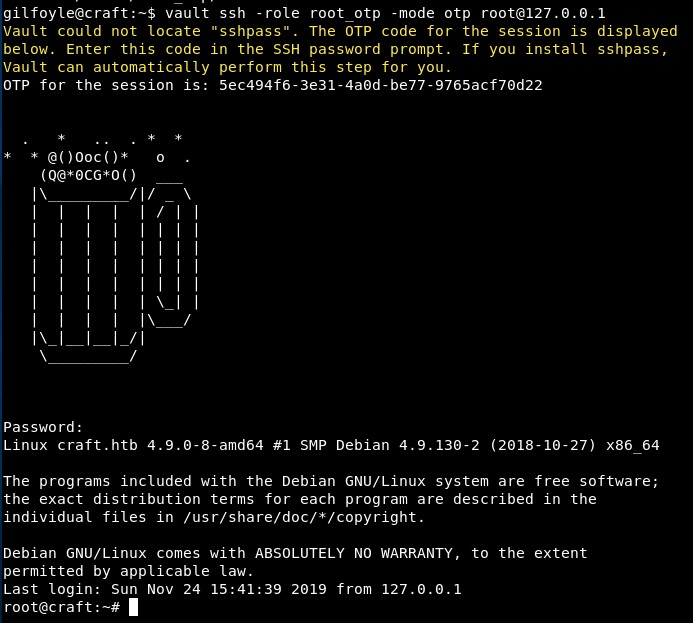

