#Forwardslash

Using tools suchs as wfuzz we can find a text file in the website:

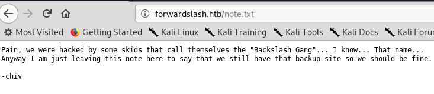

Then, we must change the /etc/hosts because the "backup site" is in a subdomain of the man domain:

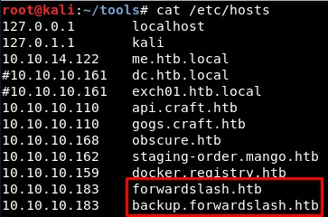

This allows us to reach a login page where we can register a user:

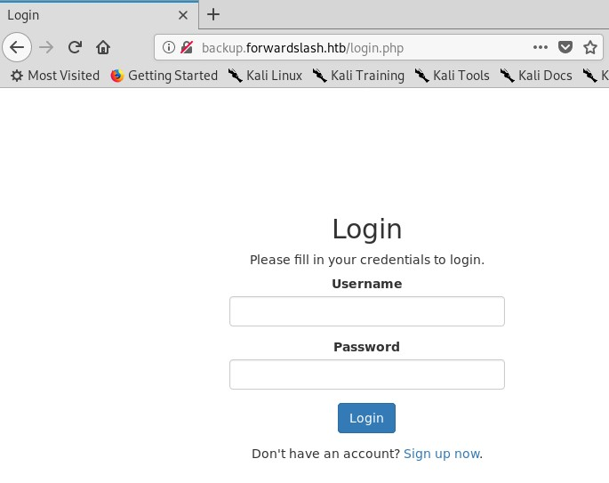

Doing so, we reach a dashboard:

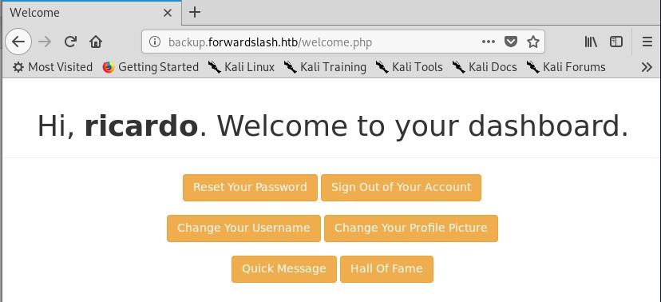

Then we will list the directories/files in this backup site:

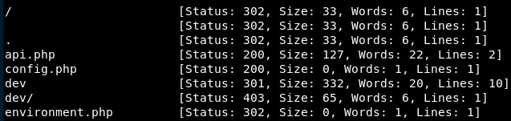

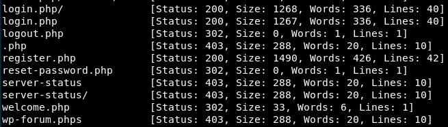

And we can find a very important message!

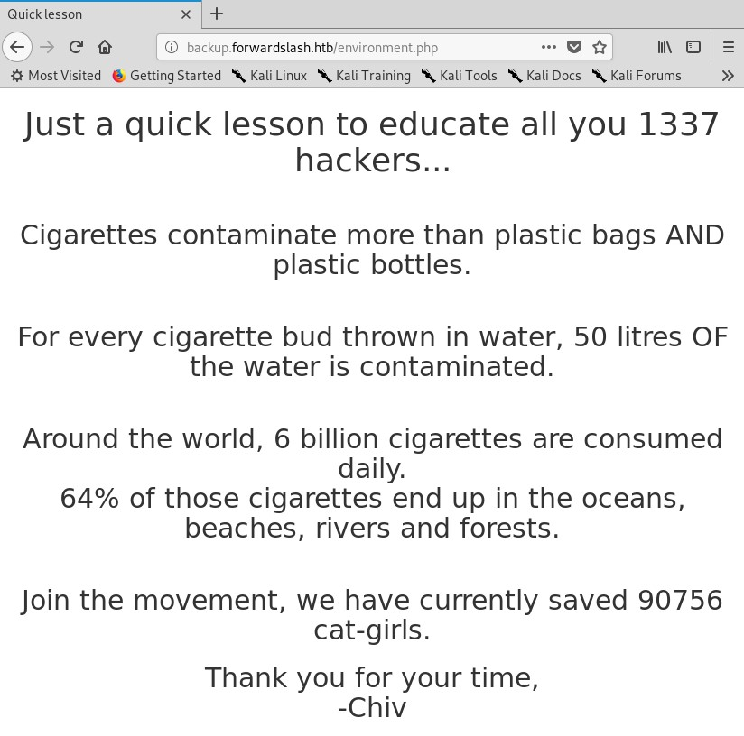

There is a disabled functionality and we can see the code:

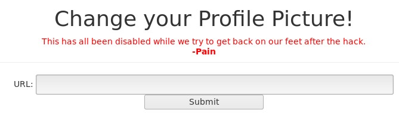

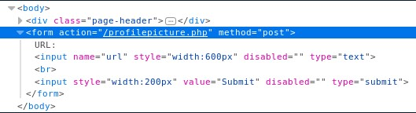

There is a vulnaerability; this hidden/disabled functionality allows to include (and display) local files (LFI vulnerability):

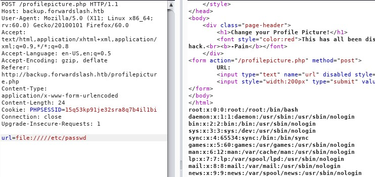

Then, we can read the configuration file and get the www-data password, which is '5iIwJX0C2nZiIhkLYE7n314VcKNx8uMkxfLvCTz2USGY180ocz3FQuVtdCy3dAgIMK3Y8XFZv9fBi6OwG6OYxoAVnhaQkm7r2ec':

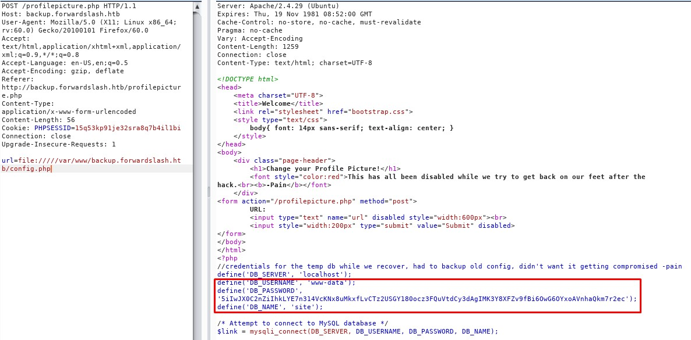

Ffuff (the tools used for listing directories/files in this case) does not find anything else other than index.php in the */dev* folder:

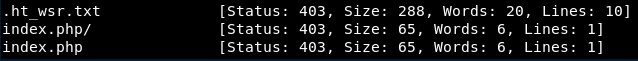

Then, we try to read the index.php of the dev folder (with *url=file://///var/www/backup.forwardslash.htb/dev/index.php*):

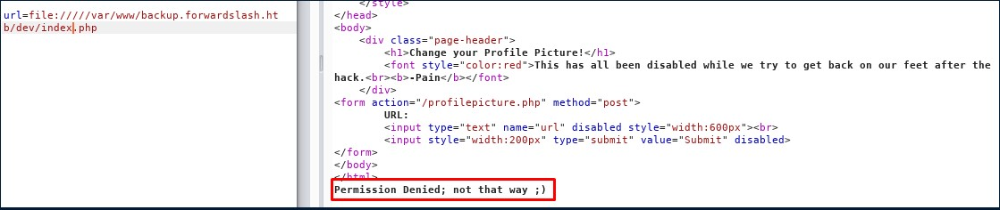

I read the PayloadAllTheThings LFI section (https://github.com/swisskyrepo/PayloadsAllTheThings/tree/master/File%20Inclusion#basic-lfi):

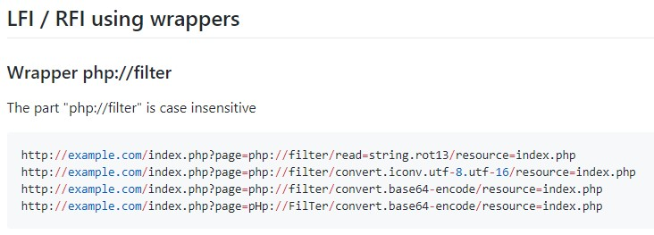

... and the first payload (which uses rot13) works:

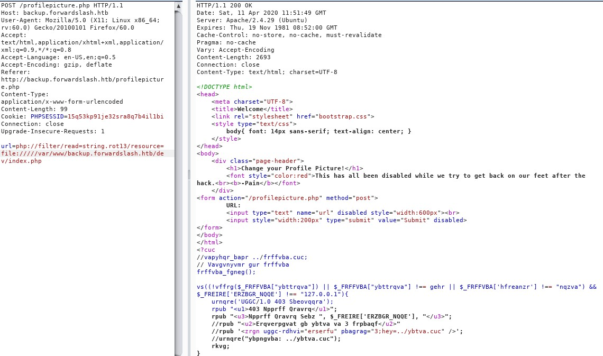

We can decode this online (in https://rot13.com/ for example):

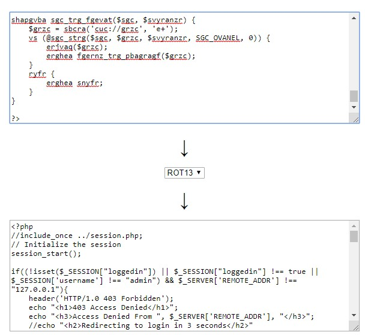

And we find out what the hackers were referring about automatic FTP upload:

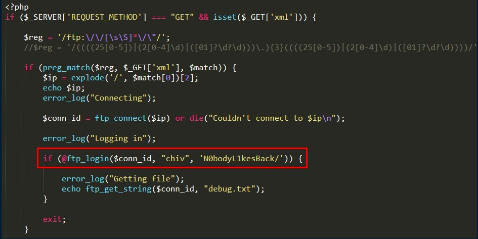

We try to use these credentials in the SSH service and get access as user "chiv":

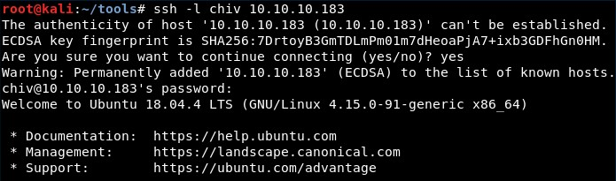

The www-data credentials we found earlier do not seem to work:

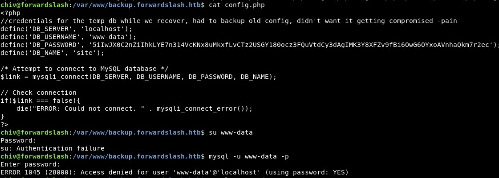

It seems we need to escalate to "pain" to get the user.txt flag:

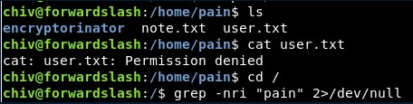

We find some files:

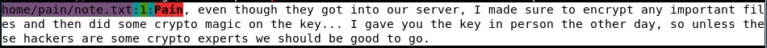

We inspect the Pain folder and we see we can read some files:

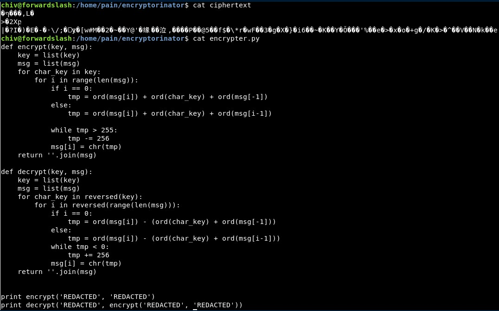

It seems Pain created a custom binary 

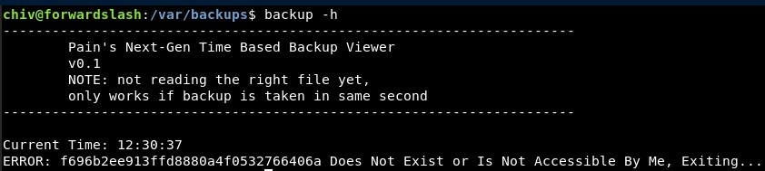

Let us try to find which file is backed up

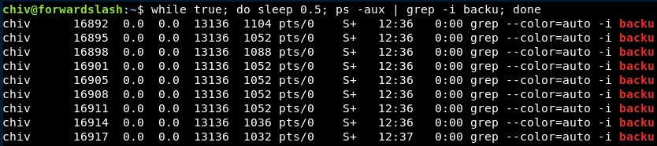

We can not find any process running related to this binary. However, it seems the "ERROR" message returns the MD5 value of the timestamp:

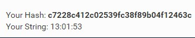

We can create a file with that same timestamp in "/tmp" folder. It complains about the file not existing the first time, then we create it and it does not complain:

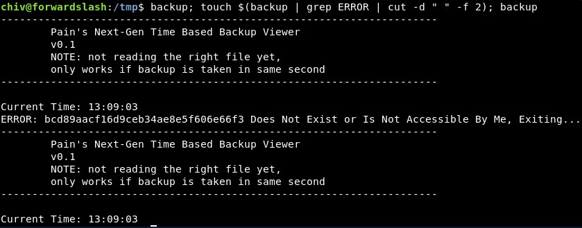

I tried to create a symbolic link but it does not work to read the user flag: 

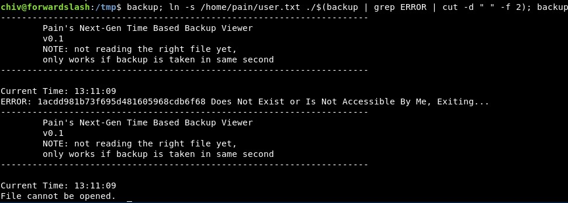

It seemed the problem was the folder! If you do the same in the chiv's home folder, you can read it:

Then, we can read more files, like this one in "/var/backups":

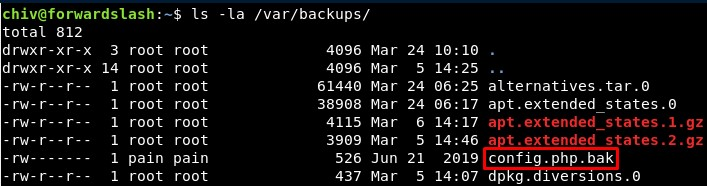

And we get Pains's password:

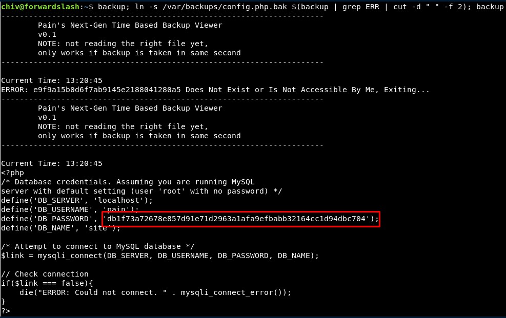

Now we can access through SSH with *pain:db1f73a72678e857d91e71d2963a1afa9efbabb32164cc1d94dbc704*:

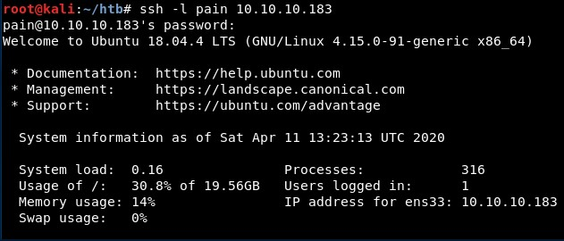

We will copy the files in encryptorinator to our local machine:

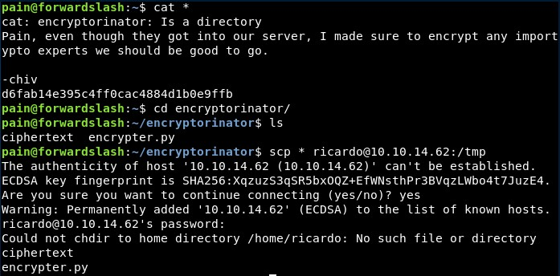

If we decrypt it, we get the password "cB!6%sdH8Lj^@Y\*$C2cf".

With that we can mount images in "/var/backups/recovery/" with a command such as "sudo /sbin/cryptsetup luksOpen /var/backups/recovery/encrypted_backup.img backup" (check "sudo -l", pain can do it!) and then mount it. And in that image, you can find the root's private key!. 

Sory I did not take screenshots of this part :P

