# Heist

The Cisco password from the configuration file can be decrypted:

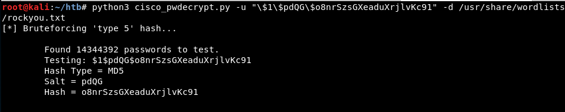

The password can be decrypted:

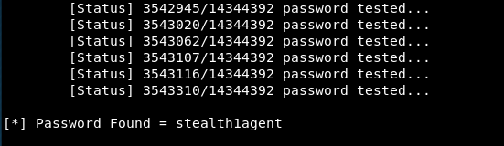

It could be Hazard's password:

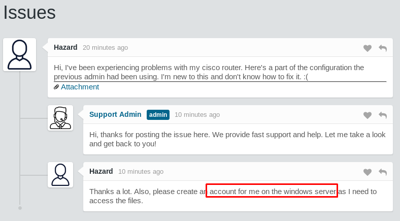

It seems to be because the authentication with psexec does not fail:

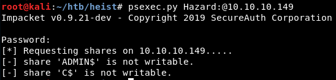

But the SMB shares are not writable:

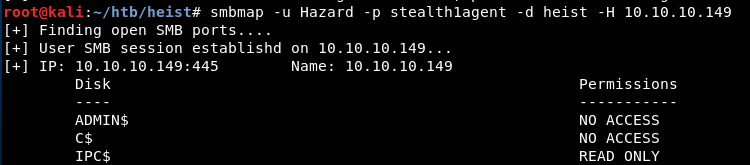

It seems there are more ports open:

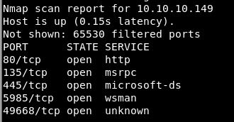

Using the impacket's *lookupsidpy* it is possible to list usernames:

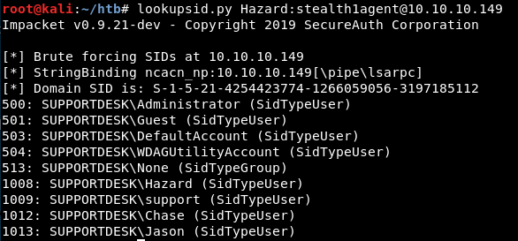

Testing the other passwords from the configuration file (which could be cracked very easily online in pages like http://www.ifm.net.nz/cookbooks/passwordcracker.html), it seems Chase's password is one of them:

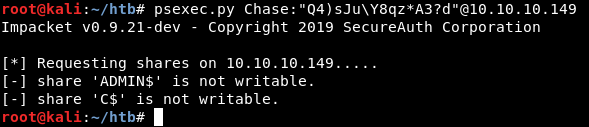

It is possible to connect through Winrm using Evil-WinRM for example:

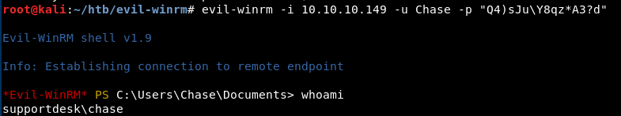

The first flag can be read:

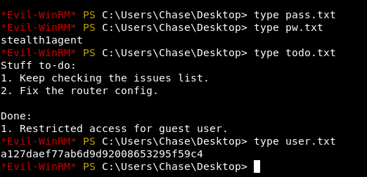

First the processes are enumerated:

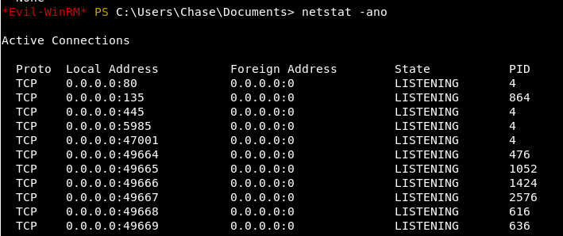

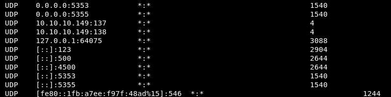

More enumeration:

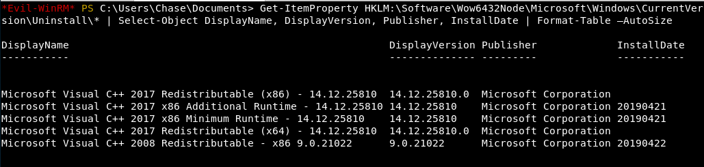

It seems suspicious that the process Firefox is running in the machine:

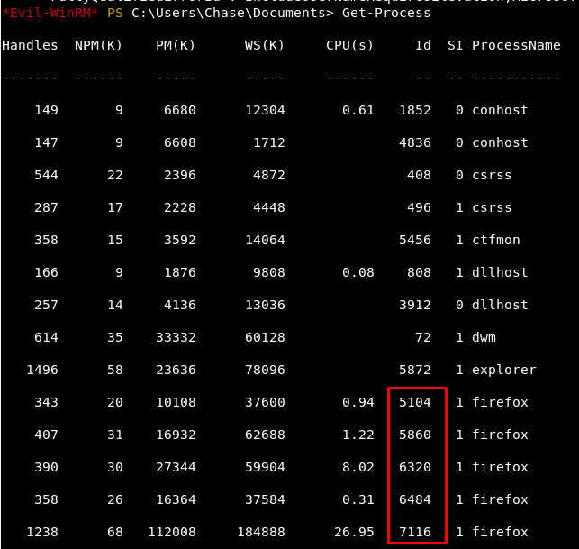

Each one can be checked with Powershell:

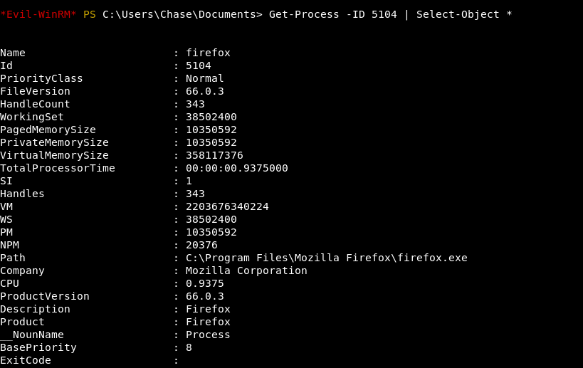

The five processes are dumped using *procdump.exe* and they are analyzed with different commands (like *strings*), and in this case the 5th Firefox process contains the password:

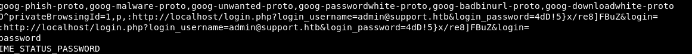

The password is reused so it is possible to access as the user Administrator with impacket's psexec:

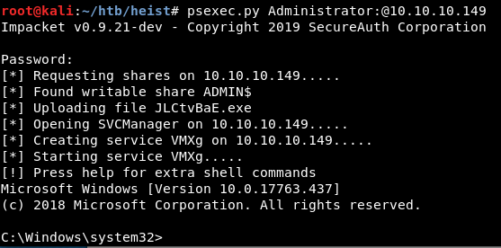

And finally the second flag can be read:

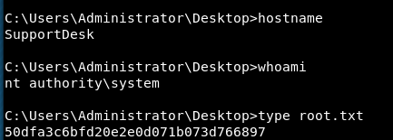

