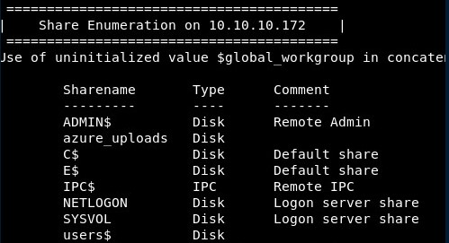
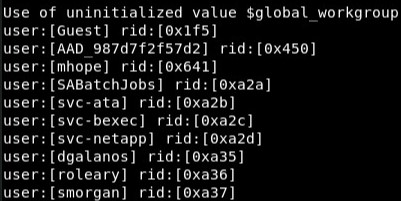
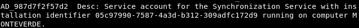
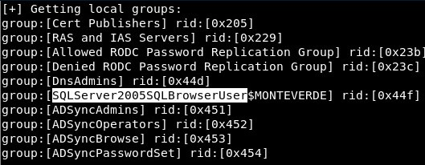
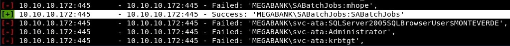
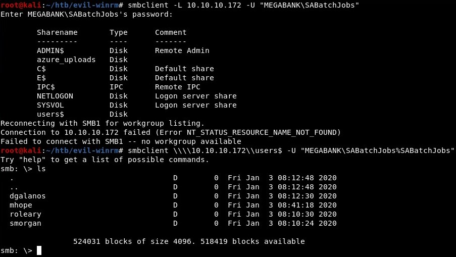
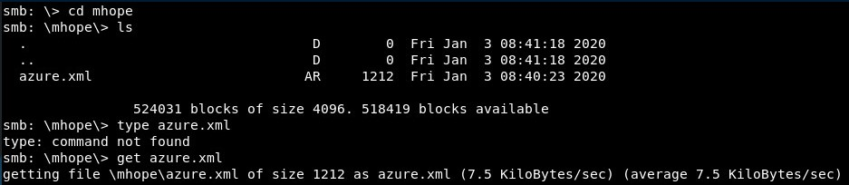
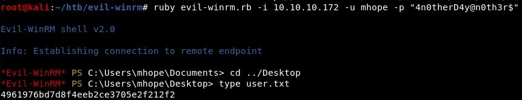

#Monteverde

SMB port (445) is open and it is possible to enumerate the SMB shares:



Using enum4linux it is possible to get information from the machine, such as some usernames:



And we can read the description of some user accounts:



Also we can list the groups:



It is possible to carry out a brute force attack and get some weak credentials (*SaBatchJobs:SaBatchJobs*):



Nice! We can connect using smbclient and read some shares:



There is an interesting file in *mhope* folder:



The file contains a password:


And using the Evil-winrm tool it is possible to access with *mhope*:

```
ruby evil-winrm/evil-winrm.rb -i 10.10.10.172 -u mhope -p "4n0therD4y@n0th3r$"
```


Following [this Adam Chester's blog](https://blog.xpnsec.com/azuread-connect-for-redteam/), we can decrypt the Administrator's password:

And using again Evil-winrm we can get the root.txt flag!

