# Obscurity

There is a web server in port 8080. We will fuzz itt using Ffuf (be careful if using this tool in production, it may break things!). A folder "/developer" is found::

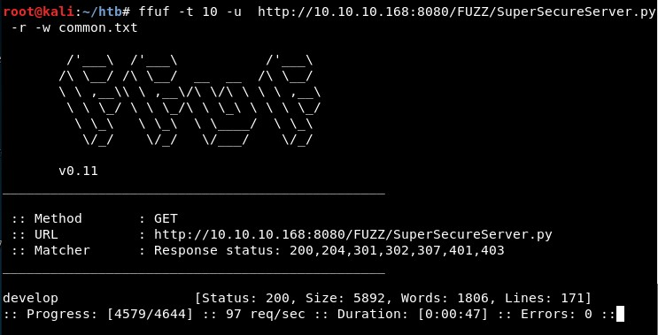

The super secure script is found in this folder:

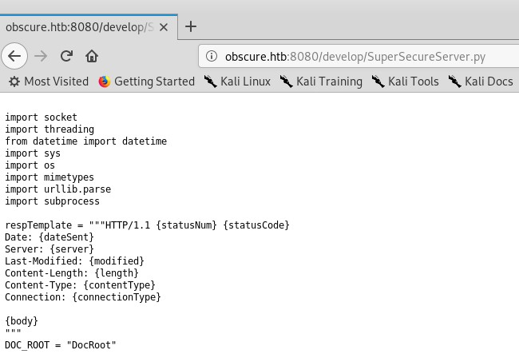

This is the code I used to extract the key:

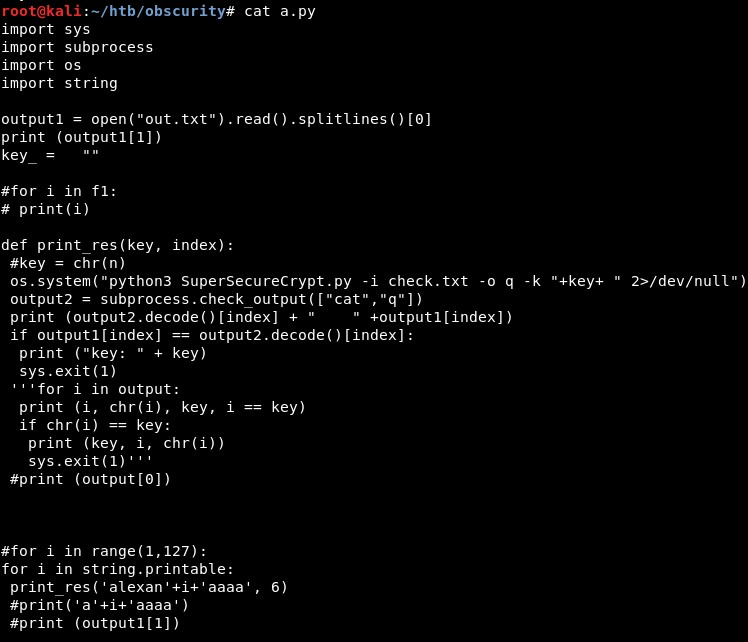

The final key is "alexandrovic":

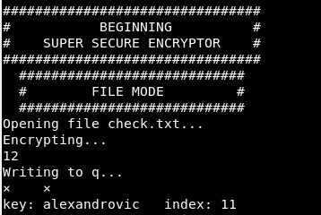

And the passwordreminder.txt file can be decrypted now!

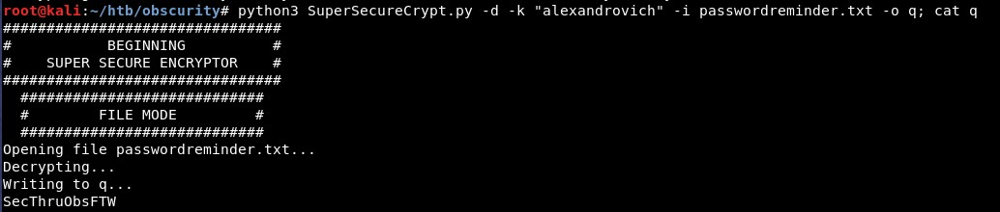

Now we can sudo as "robert":

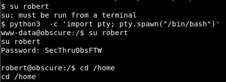

Then we read the user flag:

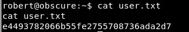

Using "sudo -l" we can see what "robert" can execute with root privileges:

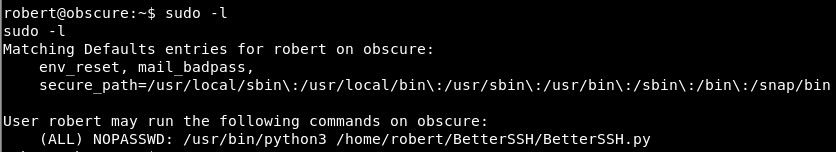

We can connect with the custom SSH service:

The user hash will appear in this folder, so we will create a loop to try to get it:

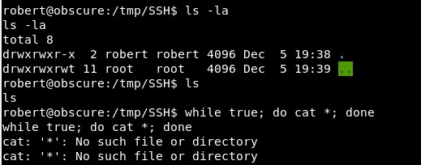

We get some hashes:

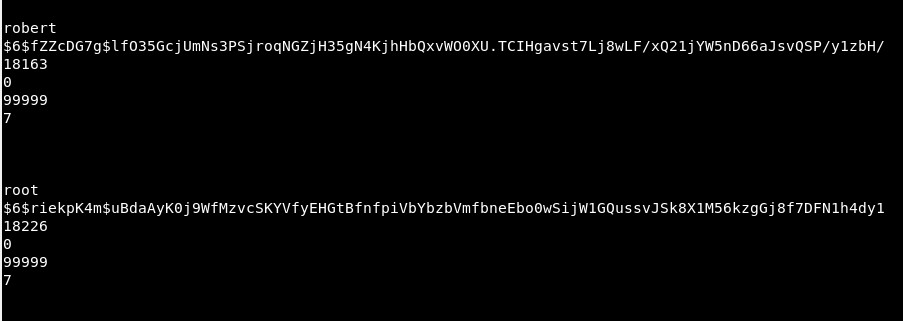

The hash can be cracked and we get the root user password:

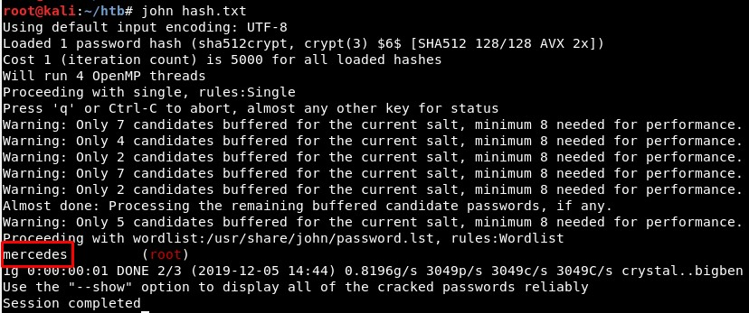

And finally we get a shell as root:

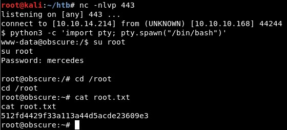

Nice, we did it! 