# HTB - Postman

The nmap scans show there is a possible vulnerable service:

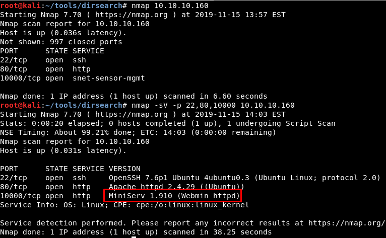

It is possible to connect to the Redis service...

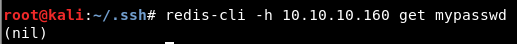

... which is running in port 6379:

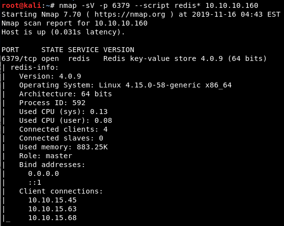

We can execute some commands:

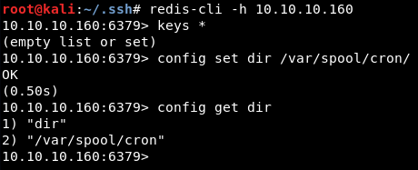

After trying to exploit it manually, I ended using an existing script:

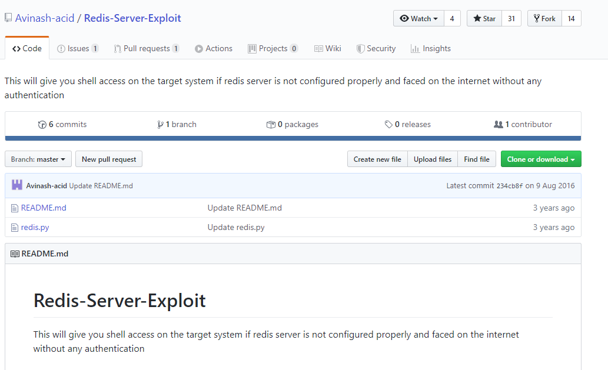

It is necessary to change the parameter *cmd4* because the SSH folder in this case is not located in the default path ("/home/any_user/.ssh")

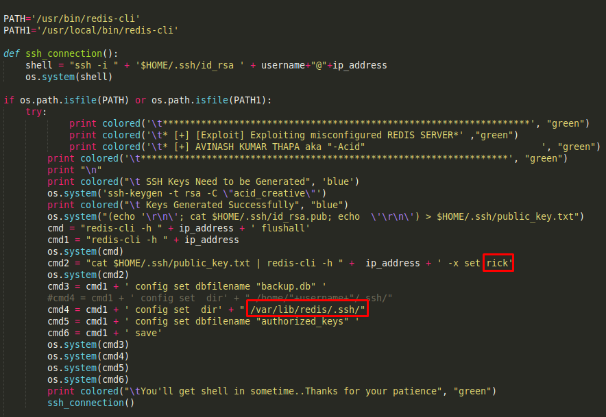

After executing it, we get a reverse shell:

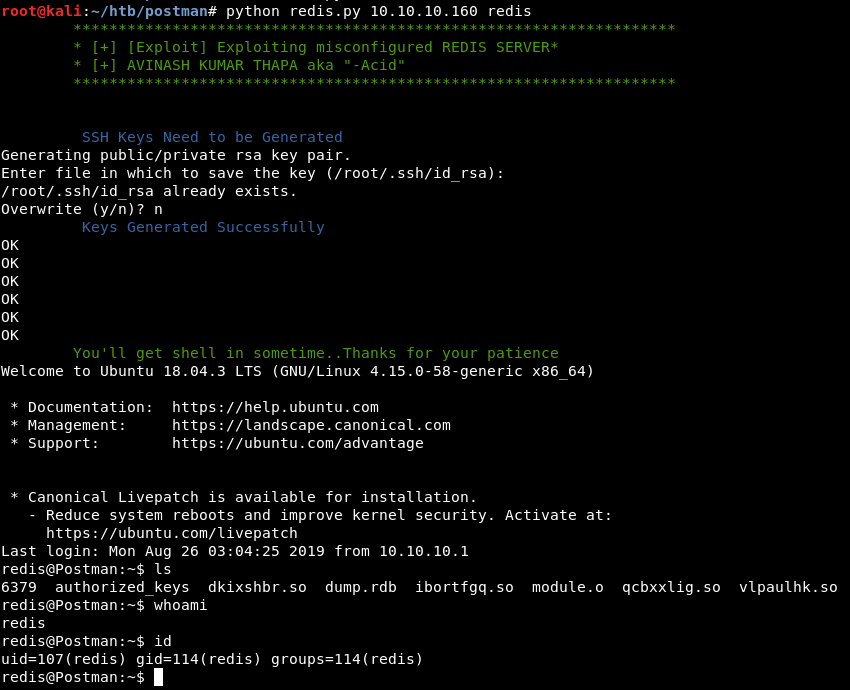

There is a suspicious backup file:

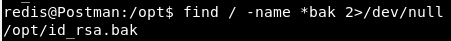

It is an encrypted SSH private key file...

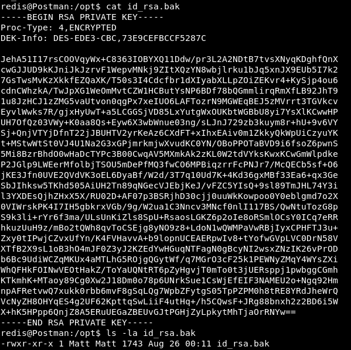

... which can be decrypted with SSH2john...

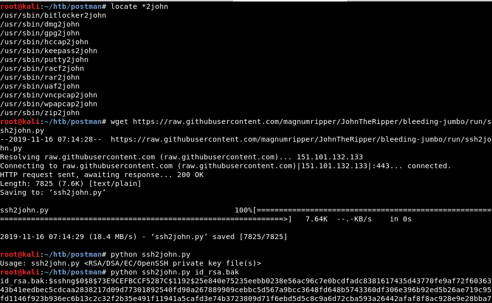

... getting its password:

With it, we become the user "Matt". We find out that its password is the same that the one of the private key

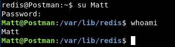

As there is a Metasploit module, it was easy to become root:

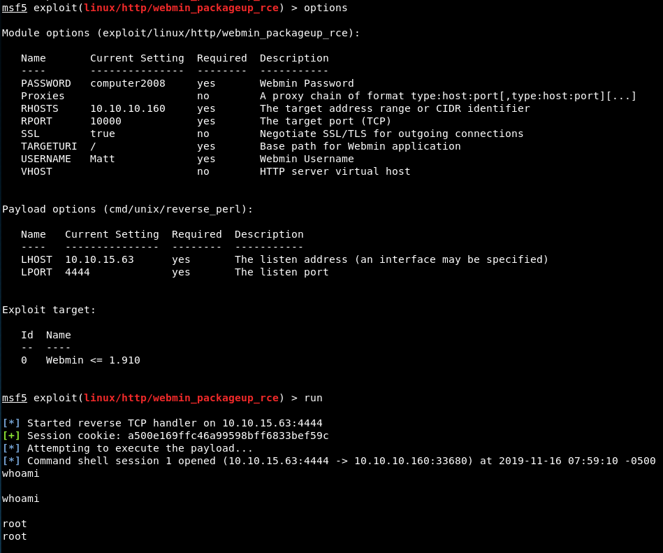

