# HTB - Registry

### Enumeration

First, we check the web certificate given that we could not see it properly:

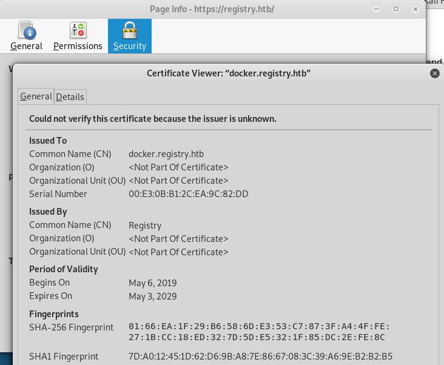

Then we add the hostname to the *hosts* file:

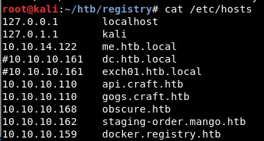

Using Nikto we find some default credentials and that the web is a Focker Registry server:

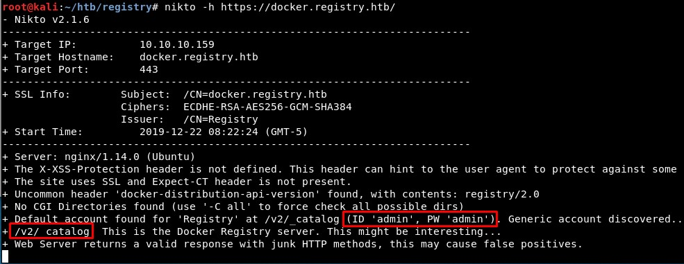

We connect using those credentials and find one repository:

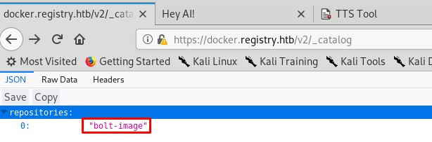

Then we will visit the Docker docs to know what else we can do:

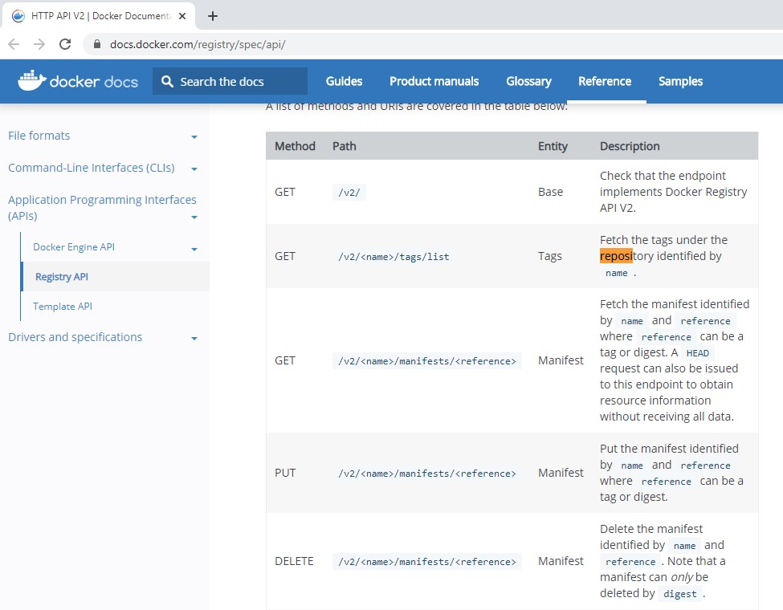

We check there is only one tag:

### Reading about the manifest

Knowing this, we can download the manifest accessing "/v2/bolt-image/manifests/latest":

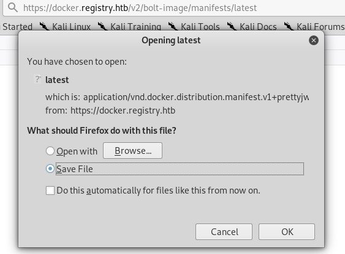

And we can read it:

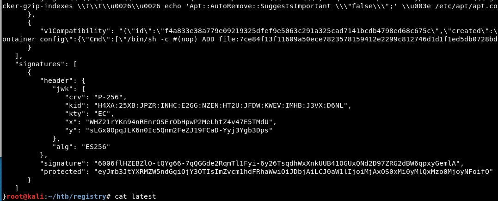

Then, read about that a manifest in Docker registry is exactly...

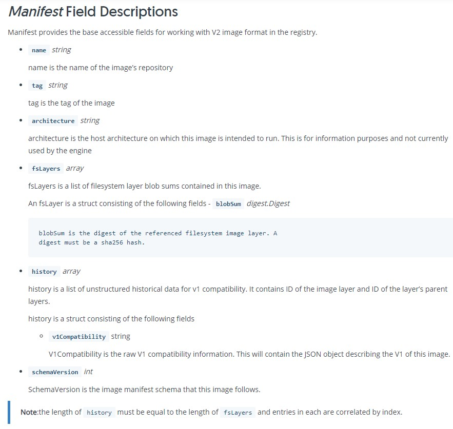

... and how they are signed:

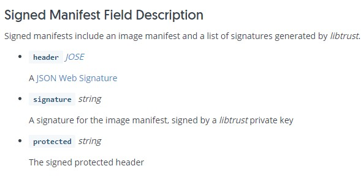

We find these values in the Manifest we downloaded:

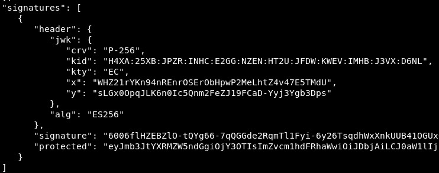

### Connection to the insecure registry

Then, we read about pulling from another registry:

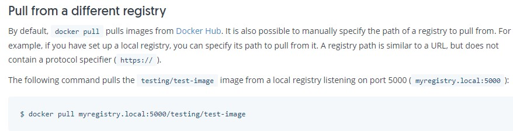

And we connect to the Docker registry, knowing it is insecure:

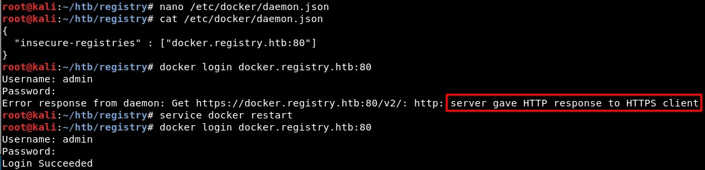

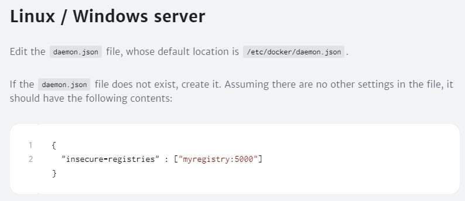

Then we pull the contents of the repository:

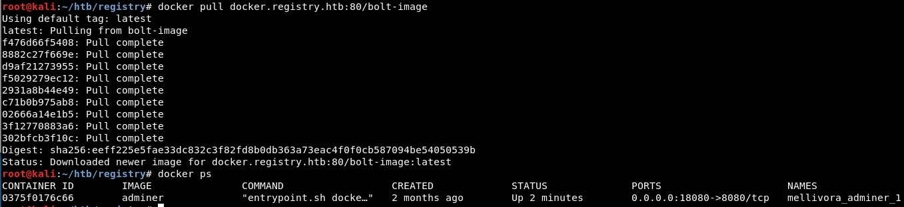

When we have downloaded it, we can access the filesystem of the Docker image with *docker run -i -i DOCKER_IMAGE_ID /bin/bash*:

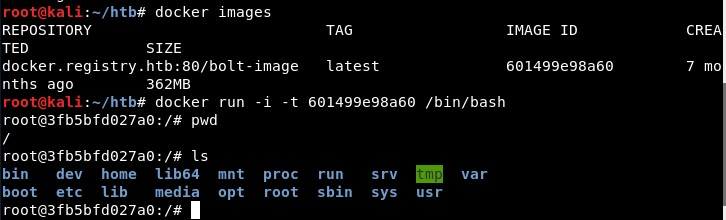

There is a bash script with rsync:

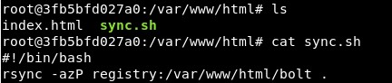

And also a public and a private key:

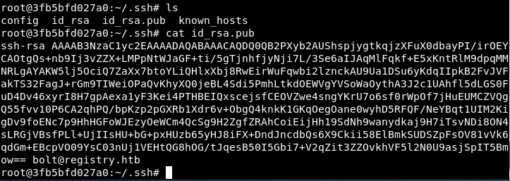

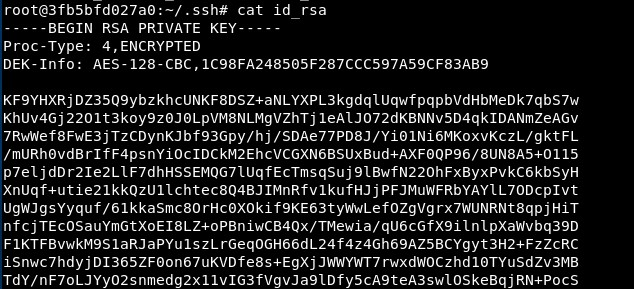

We will use John the Ripper's ssh2john to crack the password of this private key:

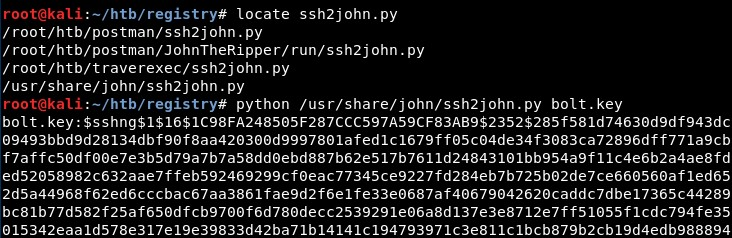

Checking the Docker image again, it seems there is another bash script with credentials in it:

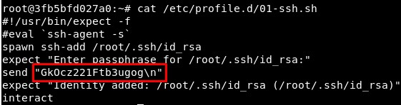

This could be found in the .viminfo file, showing it was one of the last files changed using Vim:

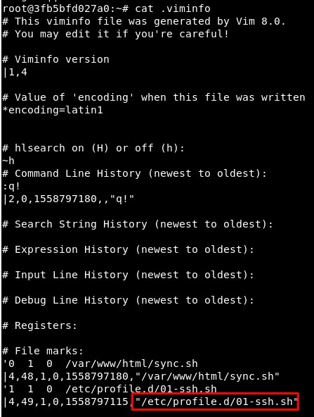

## Connection as bolt

We can connect to the machine with the private key and the root password found in the last bash script:

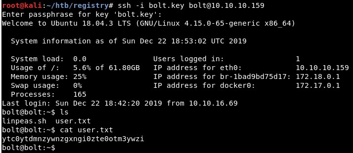

In the machine there is a bolt.db file wich contains a list of users of the website:

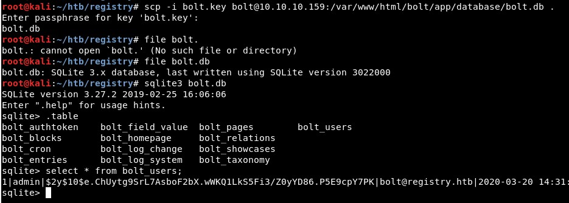

Then we crack the password...

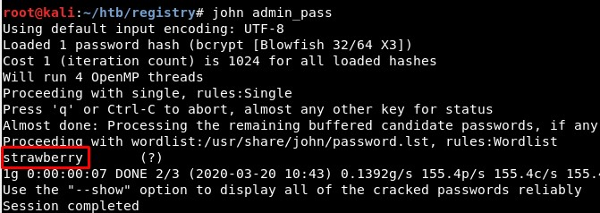

... and access the website:

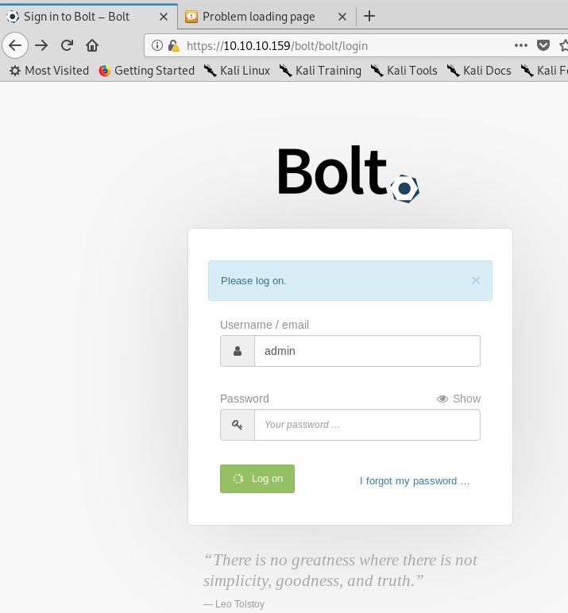

## Exploiting Bolt CMS RCE [CVE-2019-9185]

There is a public exploit for Bolt 3.6.4:

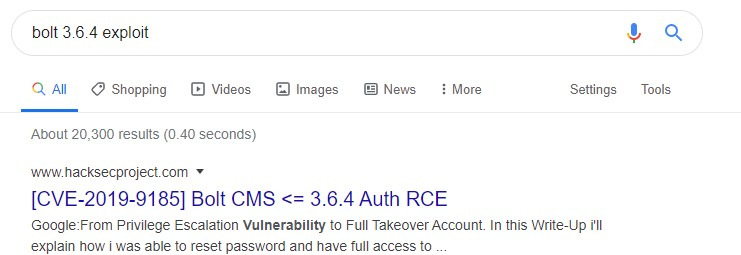

It consists of:

1. Changing the accepted file types to allow the PHP files:

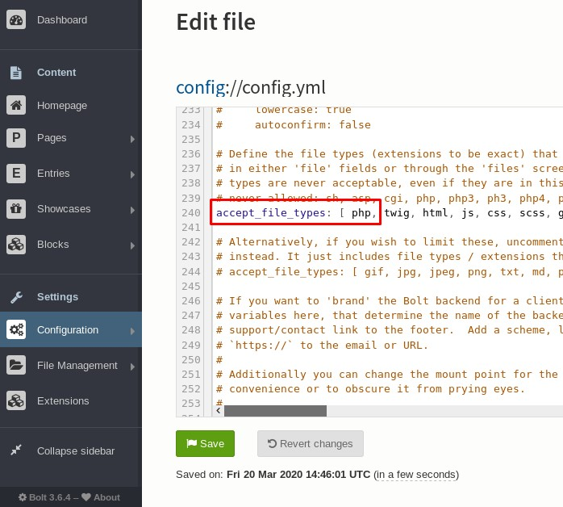

2. Creating a malicious PHP file:

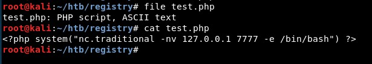

3. Upload it:

4. Get a reverse shell:

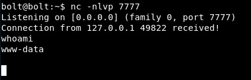

## Connection as www-data

Then we spawn a full shell and check what this user can run as superuser:

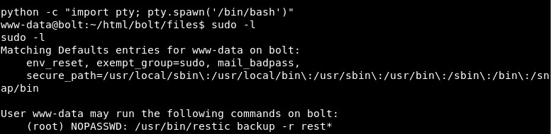

## Privilege escalation

First, I tried to create a "rest_test" folder to create a backup in the /tmp folder, but it does not work if you do not have superuser privileges:

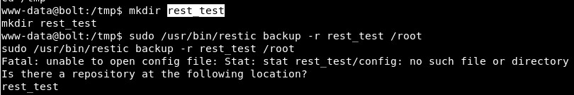

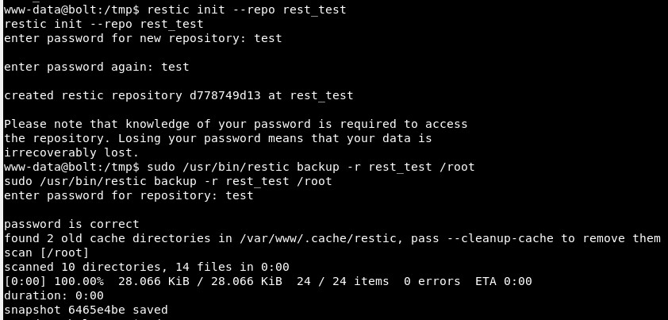

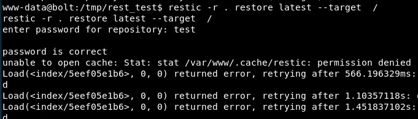

So I did it remotely, first initializing a repository:

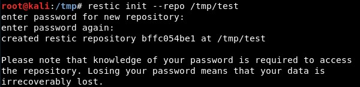

Then creating a Restic server:

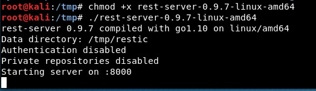

And then using a SSH remote tunnel to take the local 8000 port to the port 9999 of the remote machine:

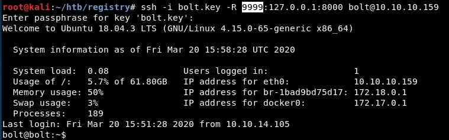

Note: Syntax of SSH remote tunnels:

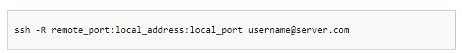

Then, the backup is generated:

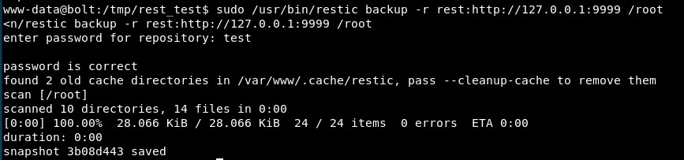

The repository is restored to the latest version (this was the step which could not be done locally in the remote machine, but now we are root) and we get the root folder contents!

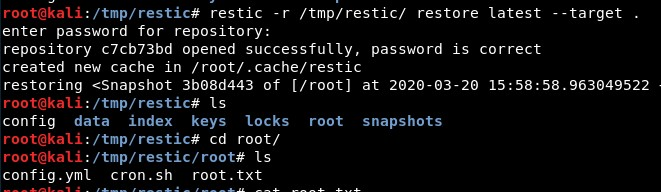

And rooted! It was a nice box, learning about Docker registries, connecting to Docker images, exploiting a CMS CVE and escalating privileges generating a backup.

