# Servmon

First, we find the website has a LFI vulnerability which allows us to read any file:

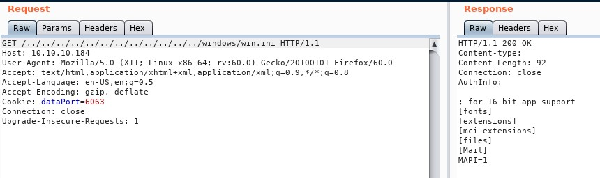

Also, the FTP server allows anonymous authentication:

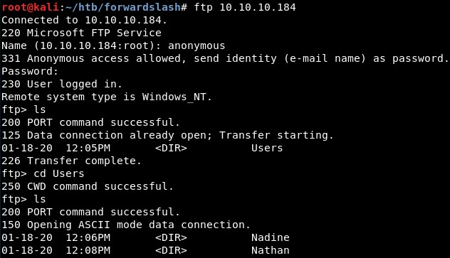

In Nadine's folder we find intesting files:

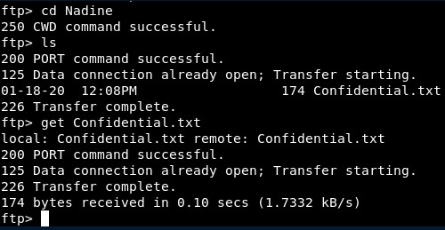

This is the content:

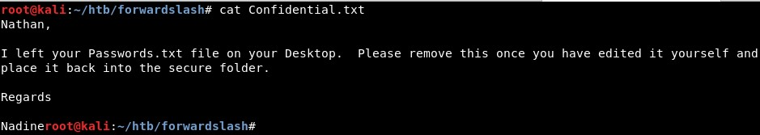

As we know this, we can see what there is inside that file:

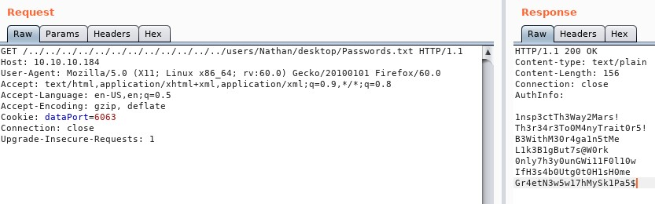

So we have these passwords:
- 1nsp3ctTh3Way2Mars!
- Th3r34r3To0M4nyTrait0r5!
- B3WithM30r4ga1n5tMe
- L1k3B1gBut7s@W0rk
- 0nly7h3y0unGWi11F0l10w
- IfH3s4b0Utg0t0H1sH0me
- Gr4etN3w5w17hMySk1Pa5$

And we get access through SSH with “Nadine:L1k3B1gBut7s@W0rk”:

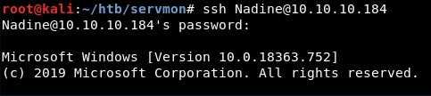

Then, we see there is a privilege escalation related to the technology used by the website (https://www.exploit-db.com/exploits/46802):

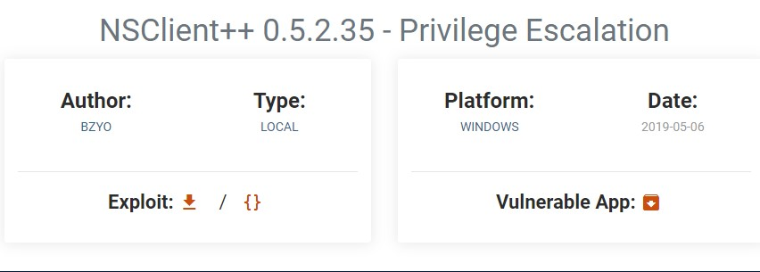

We can retrieve the password of the Nsclient program:

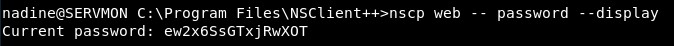

We find there is a command which is set to be executed, named zebi.bat:

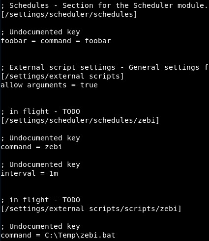

So in this case I uploaded my .bat file and overwrote the previous contents:

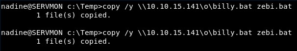

With this, I got the reverse shell:

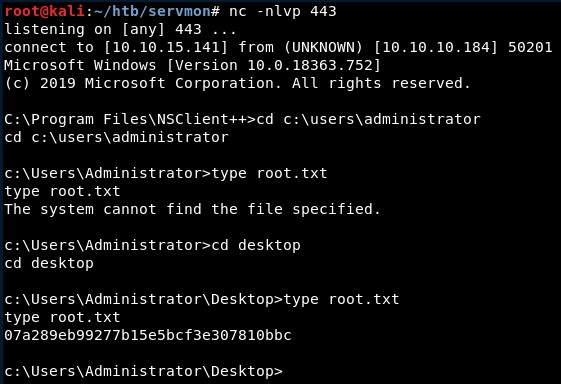
