# HTB - Sniper

First we can the ports in the machine:

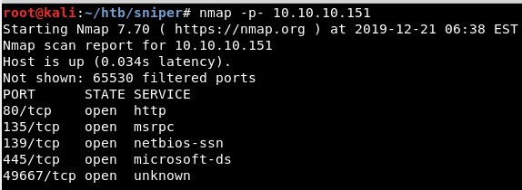

And check the versions. Nothins specially interesting:

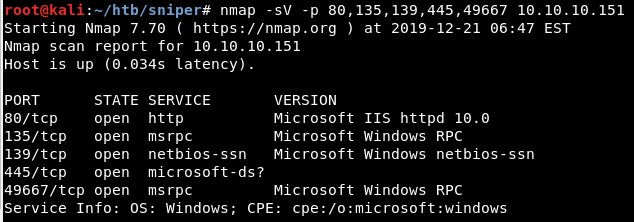

This is the website, which allows to change the language:

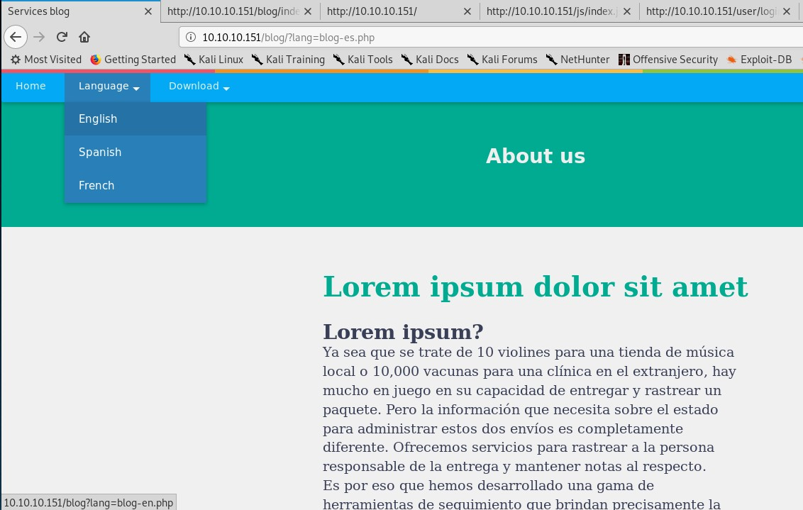

This is the code for changing the language:

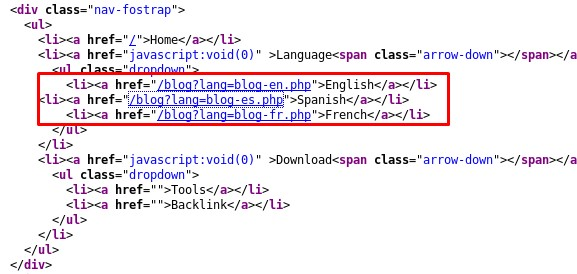

That code could include the code from those PHP files, so we will try to execute a reverse shell located in a SMB share in our machine.

First, we create a SMB share in the Kali machine:

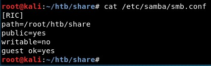

Second, the PHP paylaod is created with msfvenom:

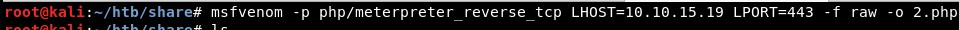

Then, we try to execute the file due to a RFI vulnerability:

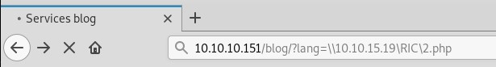

And it gets executed correctly! We get a reverse shell as IUSR:

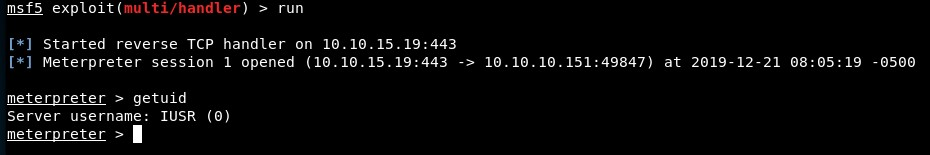

We can list the files:

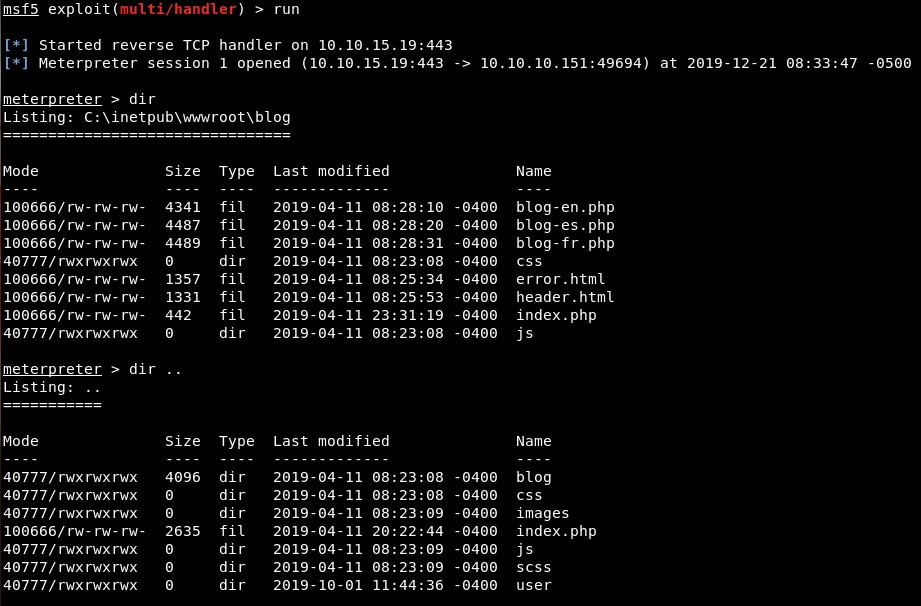

One of them contains the credentials of the database:

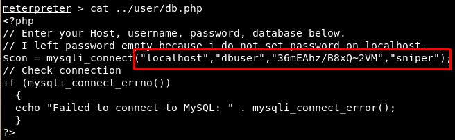

And we can list all the users in the machine:

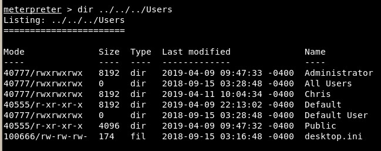

It is possible to read a Powershell script with the credentials of one of these users, Chris:

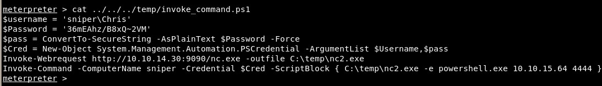

Listing the programs, we can see the Mysql service is indeed running:

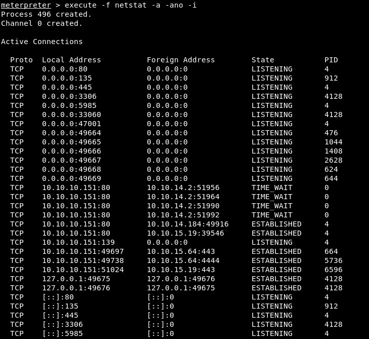

We can forward internal services thanks to Meterpreter:

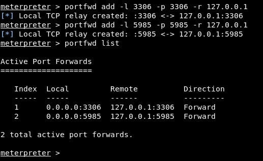

With the user credentials and the Winrm service, we can connect and get the user flag:

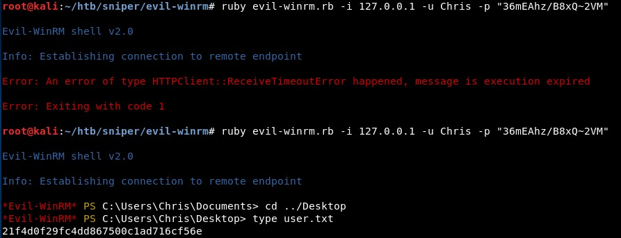

In this user's Docs folder, there is a note:

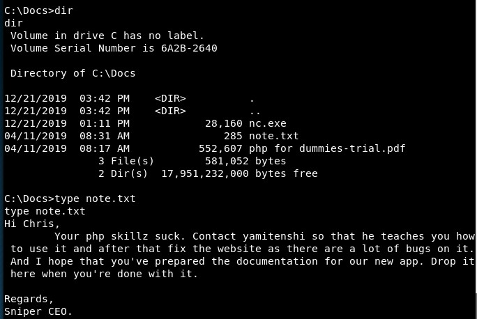

We will exfiltrate the PDF file with Netcat like this:

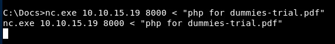

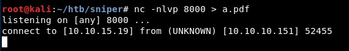

Also there is a "intructions.chm" file, which we also exfiltrate:

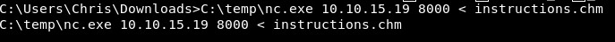

Opening it, there is a message stating that "Oddvar deeserves a CVE":

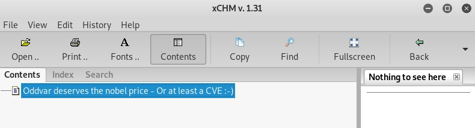

Then I found another ".chm" file and exfiltrated it again:

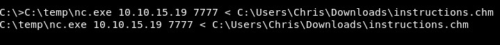

F@$&%! This was the real one, someone had changed the original already:

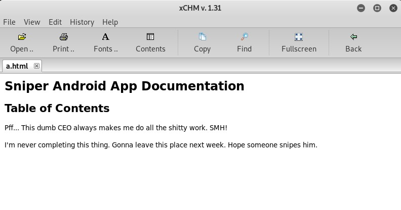

However, I had already found something about Oddvar and CVEs in Google:

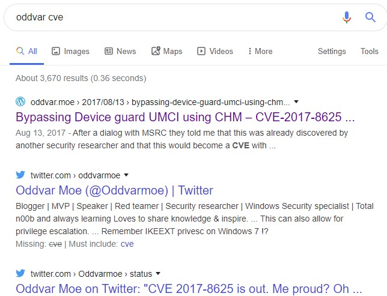

This blog has a link to a very interesting script:

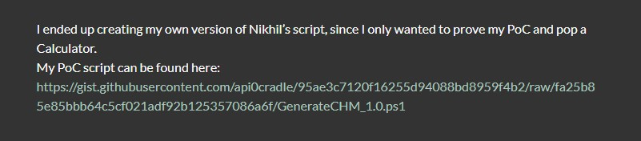

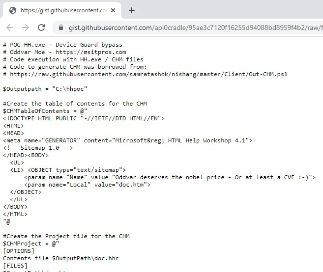

I downloaded the *HTML Help Workshop and Documentation* to generate these files:

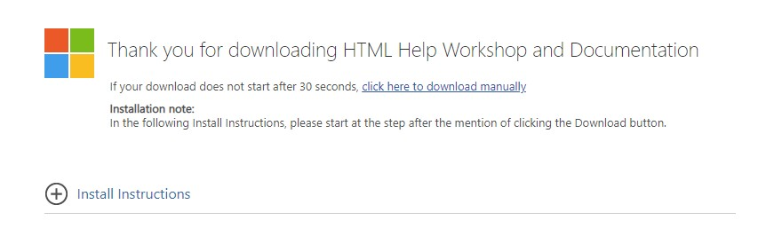

Than, I changed one of the variables...

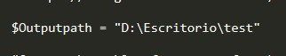

... and created a malicious ".chm" file...

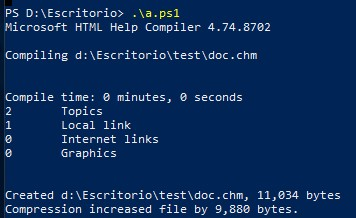

... which gets generated correctly!!!

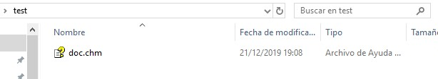

We create another malicious ".chm", this one will send the file "root.txt" in the Administrator's Desktop folder using Netcat:

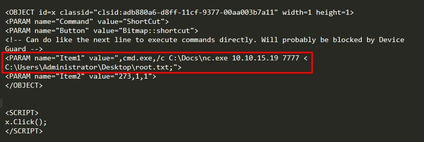

We download it to the machine:

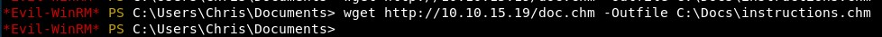

And execute it, getting the file:

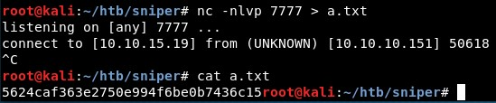

<!-- 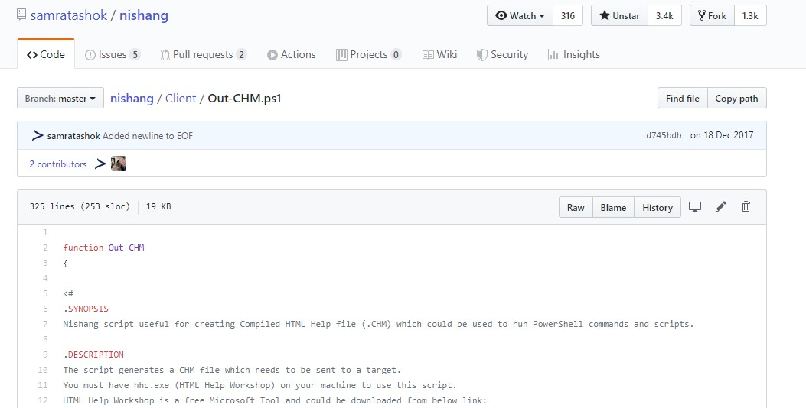 -->

Another nice box! We got a shell thanks to a RFI, used tunnels to connect to internal services and got the final shell using a client-side attack (like a ninja!):

