# Traverxec

The nmap scan shows the open ports are 22 and 80:

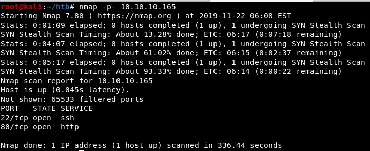

The website has a folder named "~david":

Checking the web server technology, it is a Nostromo server which is vulnerable to a RCE attack until version 1.9.6. The vulnerability is identified as CVE-2019-16278 and there is a public exploit:

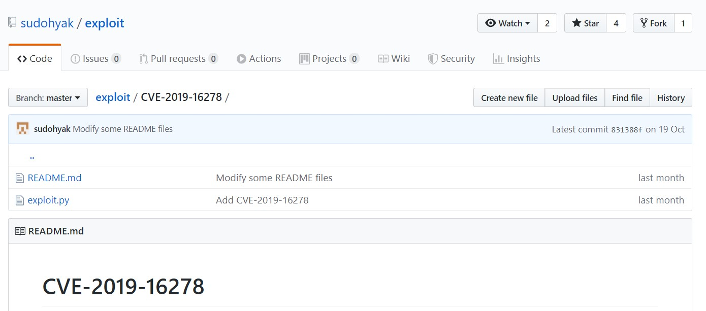

Running the Python script we can see it is running as the user "www-data":

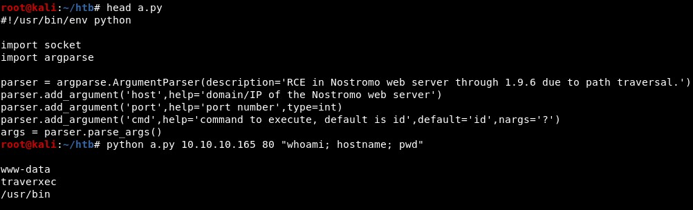

We will create a malicious binary, upload it, make it executable and execute it. First, we will upload it:

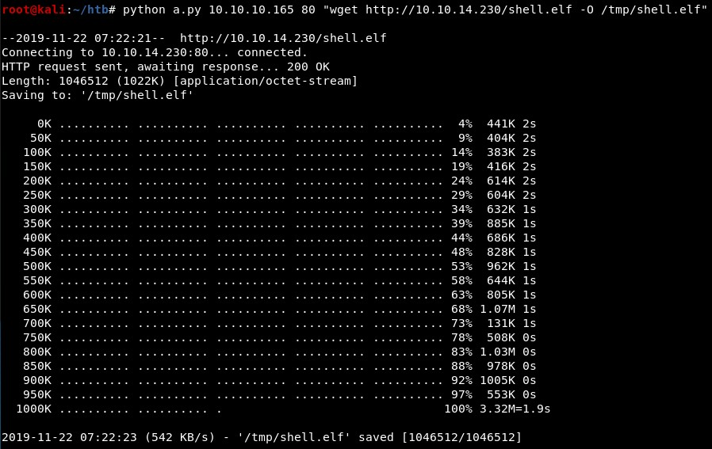

Next, we make it executable and execute it:

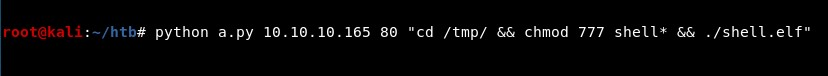

And then we get a Meterpreter session:

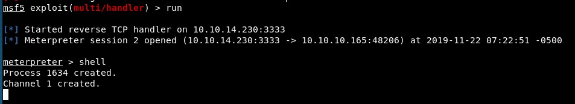

<!-- 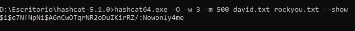 -->
<!-- 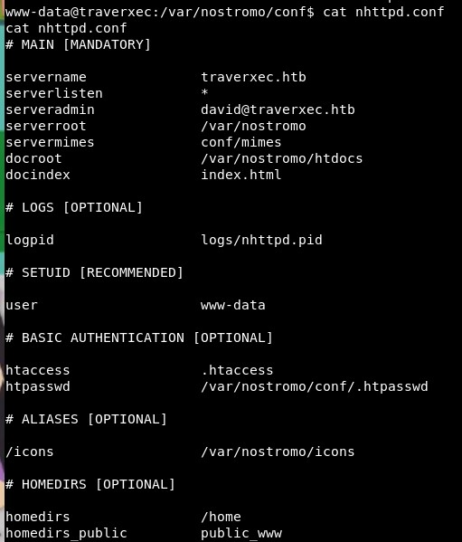 -->

There is a compressed file with the backup of "david" home folder:

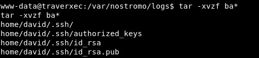

There is an encrypted SSH key:

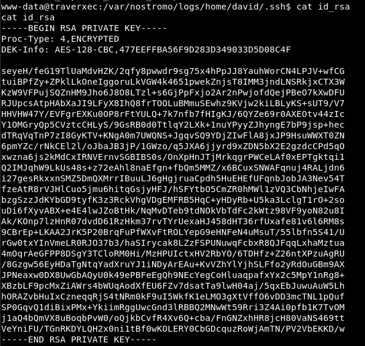

Whose password we can crack:

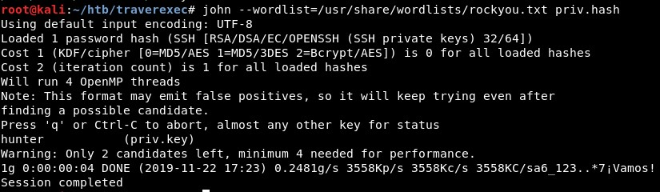

And then we can connect using SSH locally:

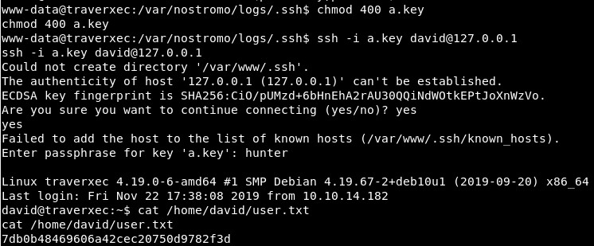

We can also connect remotely, which is more stable:

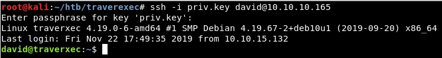

In the "/bin" folder there is a bash script which runs a command as root:

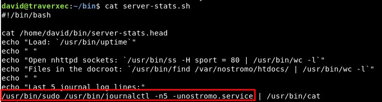

It is possible to run this as user "david":

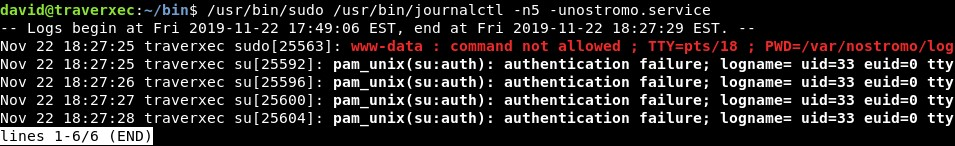

Making the terminal smaller, we can spawn a new shell:

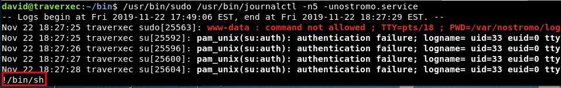

This is running as the "root" user, making it possible to read the flag:

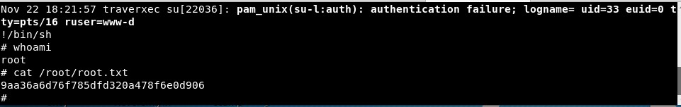

