# PwnLab: init
Vulnhub page: https://www.vulnhub.com/entry/pwnlab-init,158/
#### Information gathering

Nmap scan:

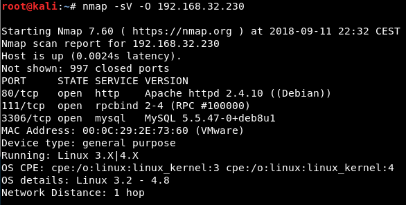

Nikto scan:

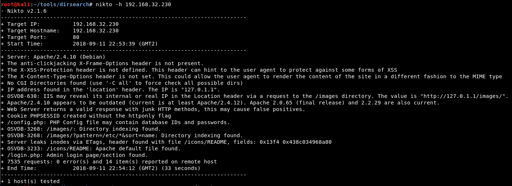

NSE scripts (nmap using --script auth,vuln):

Directory listing:

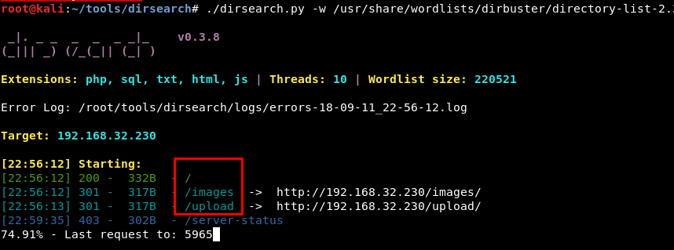

#### LFI

Check all the types of LFI from https://github.com/swisskyrepo/PayloadsAllTheThings/tree/master/File%20inclusion. One works!

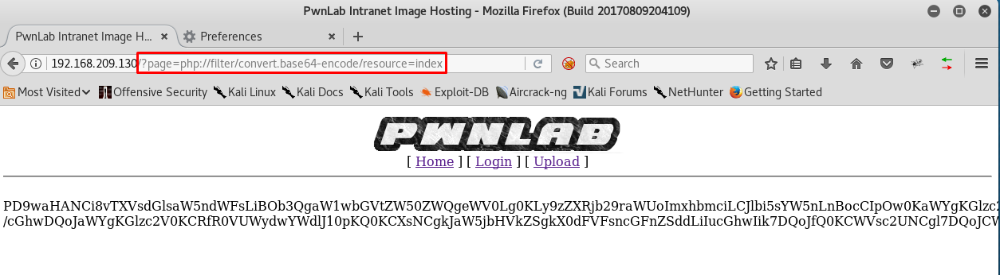

This is it:

Decode the base64-encoded text:

Test if there is a config file:

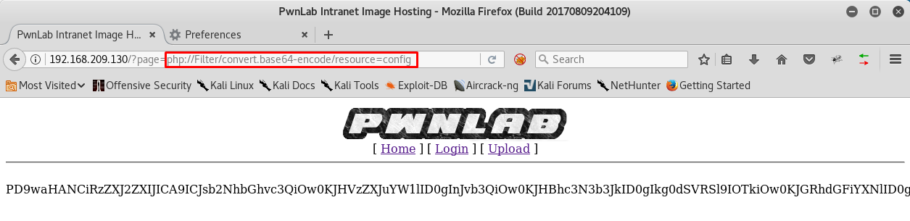

Decode it again. In this case, an online tool such as https://www.base64decode.org/ works perfectly:

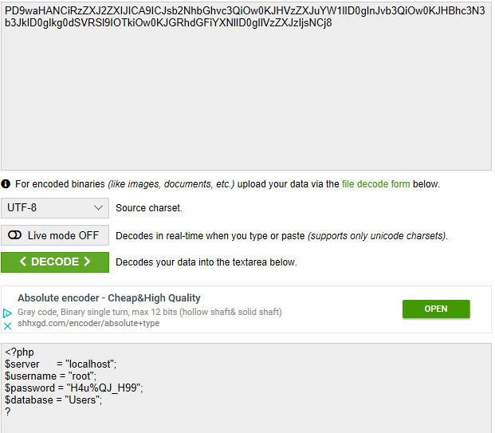

#### MySQL 

Connect using the credentials obtained:

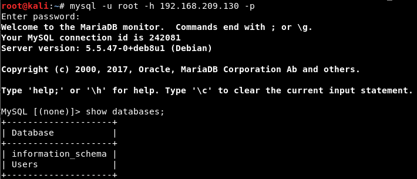

Find a table with credentials:

Decode the passwords:

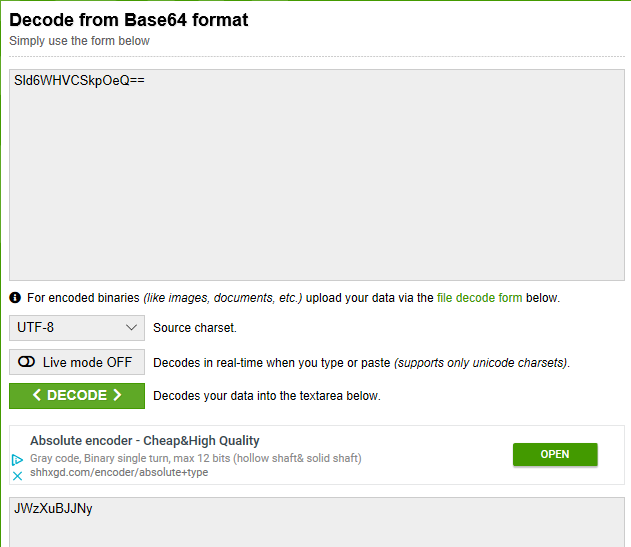

#### Upload vulnerability

Check the code in the upload page:

Create a GIF file. It will have:

- The GIF header

- PHP code to execute commands

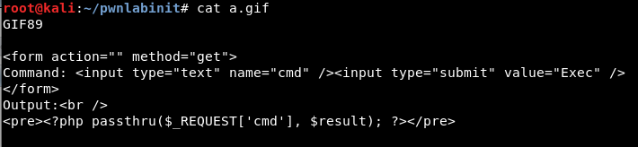

Upload it:

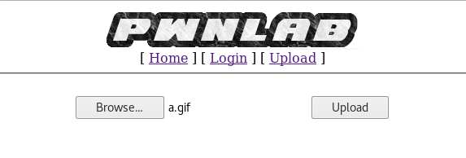

Check it is uploaded:

Access to it:

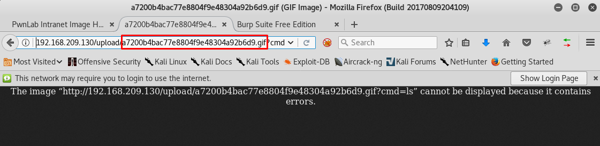

Use Burp Suite. Set the "cmd" and "lang" values to test it is working:

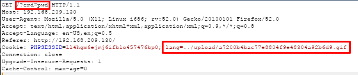

Check the result:

We will try to create a reverse shell with something similar to this:

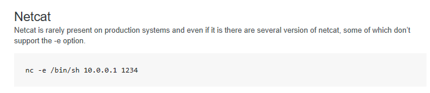

Test it:

The reverse shell is created! Check the Kernel version (recon phase):

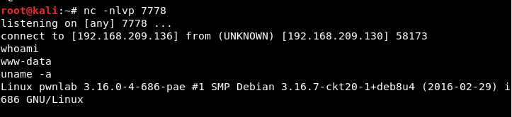

#### Message to Mike! Message to Mike! Message to Mike! 

Locate a suitable exploit:

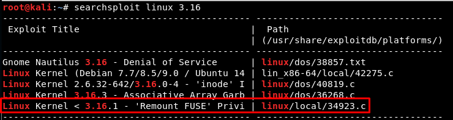

... but it will not work *cries in spanish*

But wait! There is a weird binary named "msgmike" in kane's home directory. It tries to open "msg.txt" using *cat msg.txt*. But what if we change the "cat" binary file? We could create a reverse shell (too much sufferance aint it? ;)) or, in this case, open a shell. 

We change the PATH variable value: it will search the binaries first in this folder, and then in the typical ones. So, a "fake cat" is created, we give it the execution permissions (777 is probably too much...) and we run the "weird" binary:

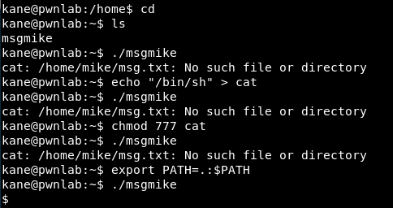

Hey! We are Mike!

#### Message to root!  

Mike's home folder has a new... weird binary. Let us check that it does:

Weell it executes any command as root, so let us just open a new shell... and we are root!

*Exit* x4

