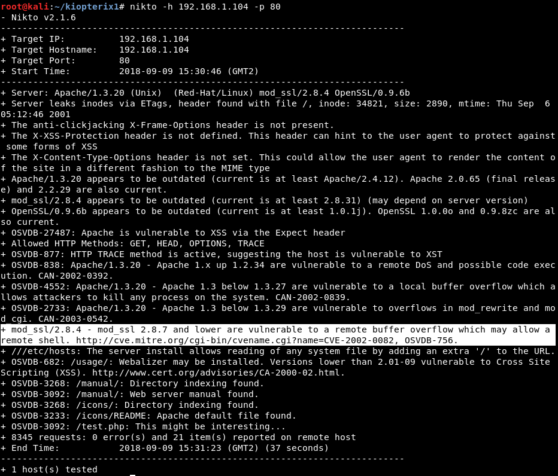

# Kioptrix 1
First VM in the Kioptrix series. As it states in the Vulnhub page: 

*This Kioptrix VM Image are easy challenges. The object of the game is to acquire root access via any means possible (except actually hacking the VM server or player). The purpose of these games are to learn the basic tools and techniques in vulnerability assessment and exploitation. There are more ways then one to successfully complete the challenges.*

Vulnhub page: *https://www.vulnhub.com/entry/kioptrix-level-1-1,22/*

# Walkthrough

#### Initial nmap scan

Scanning all ports getting the services versions:

#### SMB scan

Port 445 does not seem open but 139 does! We check if we can get information using enum4linux. It seems we can, so the "null session attack" is succesful (we could use rpcclient but this tool is faster).

We find information about Samba version: 2.2.1a

#### Check if Samba version is vulnerable

Well it seems it is...

#### Exploit the vulnerability!

We can download the 10.c script from exploit.db or we can use the tool "searchsploit" to get the exploit from our Kali machine. At the time of trying this i did not know about searchsploit so i downloaded it. Then it can be compiled with gcc and we get a root shell remotely!

## A second option

#### What does Nikto say?

Nikto says there is another vulnerability regarding mod_ssl/2.8.4! We can do a buffer overflow and get root!

#### Exploit it 

The exploit has differente options depending on the OS. In this case 0x6a or 0x6b seem very interesting, but only the latter worked in my case:

That is it! Easy but not so easy for a beginner like me...
