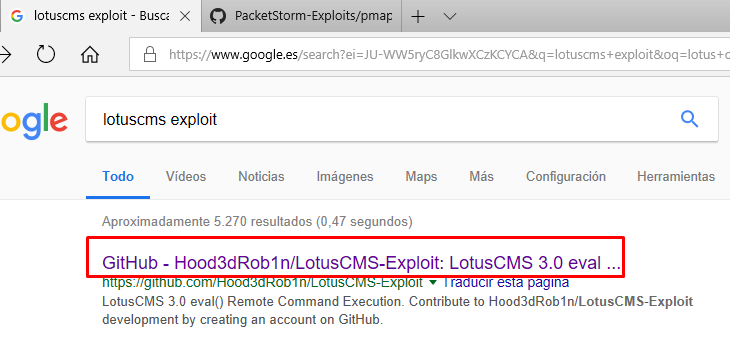
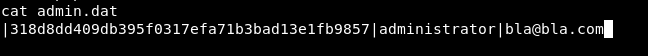
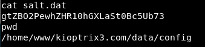
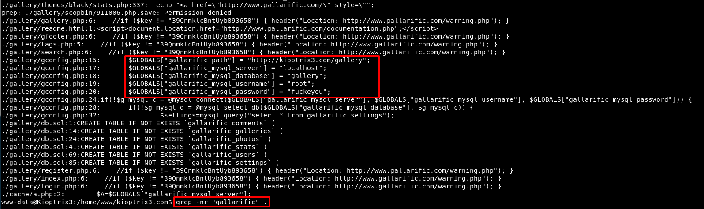

# Kioptrix: Level 1.2 (#3)
Vulnhub page: https://www.vulnhub.com/entry/kioptrix-level-12-3,24/
#### Information gathering

Nmap scan:

Nikto scan:

Directory scan (through dirsearch):

#### Information gathering in the Website

List directories in /modules:

Check PHPAdmin page:

#### Lotus exploit

Locate it:

Run it:

The reverse shell is correctly created:

#### Recon phase

Find Kernel version:

Locate and read interesting files as admin.dat or salt.dat:

I tried a lot of stuff in here, trying to deofuscate code and such, but no results. As always, it was far easier xDD

#### Locate credentials 

PHPadmin credentials are stored in clear text! In general if there is a database and you have low-privileged access, look for them! Usually they are stored in files with "config" in them. In this case:

#### PHPAdmin recon

Access using the website

Find the developers accounts table:

Read the values:

Crack them:

#### SSH access

Text

#### Subtitle

Check what can each user do with "sudo -l". Loneferret can do anything! Maybe "sudo su" would be a faster way, but let us try to do it with... awk, for example xD:

