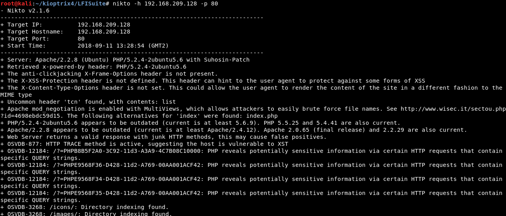
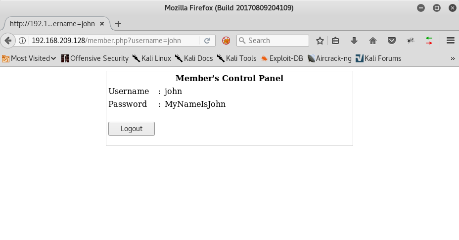
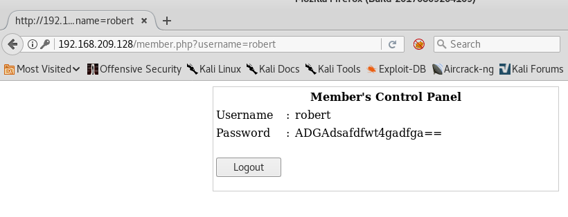
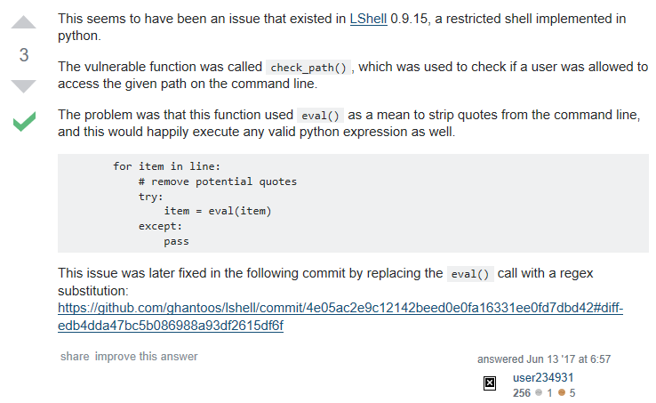

# Kioptrix: Level 1.3 (#4)
Vulnhub page: https://www.vulnhub.com/entry/kioptrix-level-13-4,25/
#### Information gathering

Nmap scan:

Enum4linux scan:

Nikto scan:

Directory listing (using dirsearch. Gobuster is cool too)

#### Website recon

Access the /member route. Test the different users found using Enum4linux:

Check there is a XSS vulnerability too:

#### SSH connection

The shell is weird! It closes the connection after 2 commands...

Well but it seems that it is possible to enumerate directories and files! At least the first one hehe...

Let us keep trying...

The "forbidden path" is suspicious... Google says it could be lshell. Let us check!

The .conf file exists... let us say it is proven that they are using it

#### Lshell exploit

We get a reverse shell:

### Escaping lshell

Explanation from Stackoverflow:

Escape:

Get Mysql credentials:

#### Mysql Exploit. RoOt!

Add the UID flag in bash binary as root user (from MySQL) and run it as John. You are root: 

