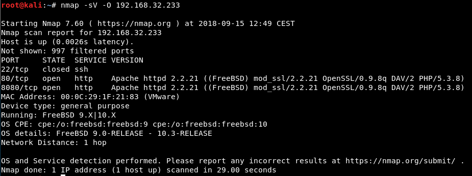
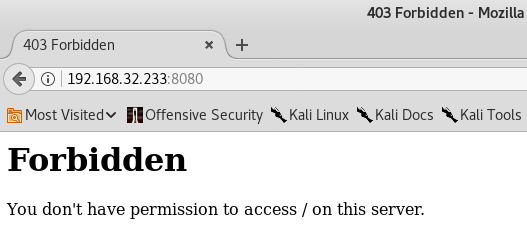
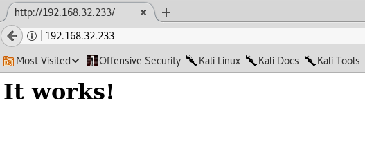
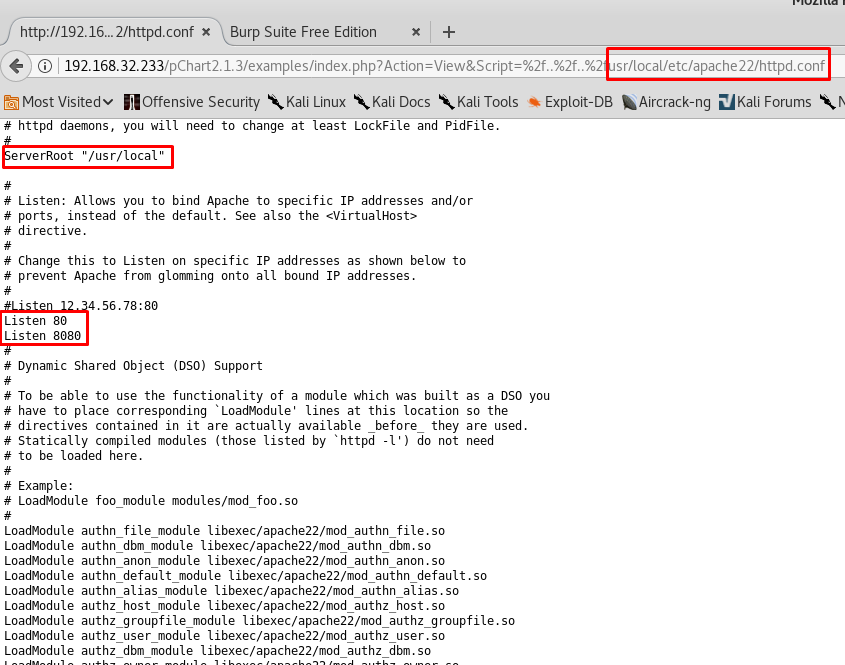
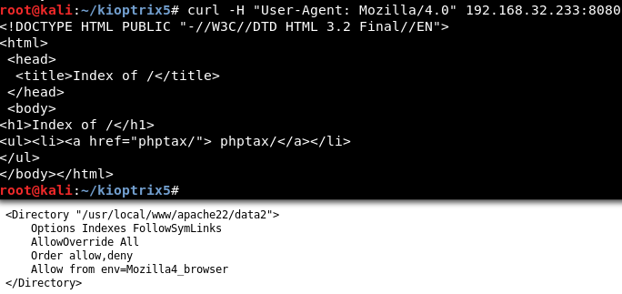
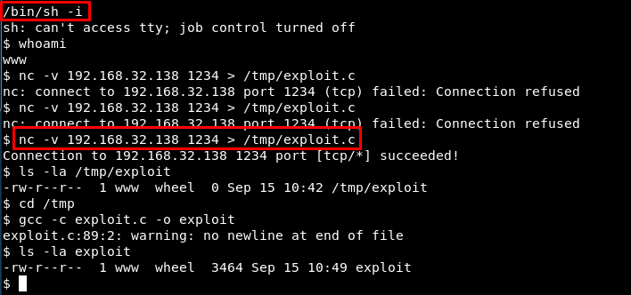

# Kioptrix: 2014 (#5)
Vulnhub page: https://www.vulnhub.com/entry/kioptrix-2014-5,62/
#### Information gatering

Nmap scan:

Nikto scan shows mod_ssl vulnerability:

#### Locate vulnerability

Use searchsploit to locate the vulnerability:

#### Compilation

Compile the OpenFuck exploit:

It seems unsuccessful:

#### Website in port 8080

It is not accesible:

#### Website in port 80

It is a default page:

But with curl:

There is a vulnerability related to pchart:

#### Directory traversal - Recon phase

#### Locate the correct User Agent

Read http.conf:

Access using curl again:

#### Locate a second phptax exploit:

This allows remote code execution:

Read the exploit:

There is also a Metasploit module:

#### Metasploit module

Set the parameters and run it:

#### Locate if there is a Kernel or OS exploit

#### Upload and compile the exploit

Check it is downloaded from our host:

#### Get root!

There are more possibilities:

