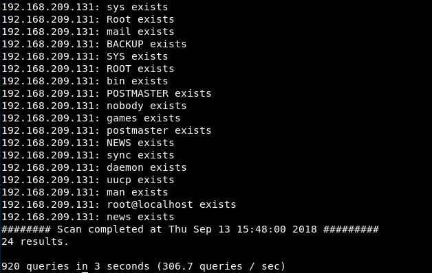
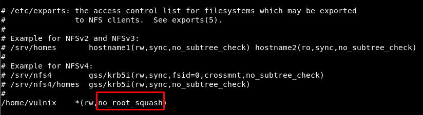

# HackLAB: Vulnix
Vulnhub: https://www.vulnhub.com/entry/hacklab-vulnix,48/
#### Information gathering

Nmap scan. OS detection:

Using the NSE scripts:

Enumerating SMTP users:

Checking some SMTP users (ricardo does not exist, lp exists):

#### NTFS share 

Detect it:

Check permissions (why can not i access!!!):

A futile, futile test:

A second futile, futile test:

Nope, not working... This is not the way, indeed!

#### NFSpy

Test if it can be mounted using NFSpy:

Now, do it without using the "ro" (read-only) option... xD

Create a .ssh folder and add your SSH key:

#### SSH connection

Now you can connect the system using your SSH key:

Check what you can execute as superuser:

Execute it! Change the "root_squash" to "no_root_squash"

#### Privilege escalation

With "no_root_squash" we can mount the share and change permissions as the root user. Let us create a "bash" binary with the UID flag! But first let us test it with a file named "a":

In the server it seems to be owned by root. Let us try to the same with bash now. Copy the binary:

Change owner and permissions:

### Get root

